# 对接说明：H5 与原生 App 路由跳转、WebView 容器和返回规则

## 基本信息

- 编号：BRIEF-2026-0605-H5-NATIVE-ROUTE-MAP
- 状态：H5 已实现首版；iOS 调试壳已实现首版；Android 待接入
- H5 负责人：待填写
- 原生 App 负责人：待确认
- 目标联调时间：待确认
- 目标上线环境：测试环境优先
- 飞书知识库链接：<https://v05ctaei9gn.feishu.cn/wiki/OJk1wa43PiR9lTkYs2YcW8llnmf>

## 需求背景

MeuMall H5 页面运行在原生 App WebView 中。当前 H5 与原生 App 已有初步 Bridge 调试能力，但路由跳转、WebView 容器、返回手势、切 Tab 和关闭页面的规则尚未统一。

如果不先统一这些规则，会出现以下问题：

- 首页、推广首页、我的页被二级页面覆盖，返回后滚动位置和已加载内容丢失。
- H5 二级页直接 `router.push("/")` 或 `router.push("/promotion")`，导致当前二级 WebView 内又打开一个首页或推广首页，形成多个根页面。
- 原生滑动返回不知道应该返回 H5 history，还是关闭 WebView。
- H5 与原生对“跳转”的理解不一致，后续 Bridge 对接效率低。

本文先按真实页面梳理页面清单、跳转关系和容器策略，再从中反推原生 App 需要实现的能力。

## 当前统一结论

- 首页、推广首页、我的页是 Tab 根 WebView，原则上常驻缓存。
- 从 Tab 根页面进入 H5 二级页，默认新开 H5 WebView。
- 二级页面内部继续下钻，默认在当前 WebView 内 H5 push。
- H5 二级或三级页面返回 Tab 根页面时，不在当前 WebView 内直接打开根路由，必须通过 Bridge 请求原生切 Tab 并关闭当前 WebView。
- `/member` 不作为正式页面，后续删除；会员/达人体系归入推广首页、权益中心、达人等级等页面。
- 推广首页头像、昵称、徽章不应跳权益中心；H5 已在 2026-06-09 修正为不发起跳转。
- 权益中心不跳活动详情。活动详情只从活动中心进入。
- 2026-06-09 H5 已新增统一跳转层 `src/lib/navigation`，业务页面通过 `HybridLink` / `createHybridNavigator()` 发起跳转，不直接拼 Bridge 信封。
- 2026-06-09 iOS 调试壳已能消费 `webview`、`tab`、`back`、`close_webview` 和 `route_changed`；原生页当前按具体 route（如 `settings`）消费，分享、登录重认证仍是占位或待正式实现。
- 2026-06-12 H5 已调整原生页打开协议：`native-page` 只保留为 H5 侧容器策略名，Bridge 信封不再发送 `route=native_page` 和 `params.name`，而是直接把具体原生页面名放到 `payload.route`，例如设置页发送 `payload.route="settings"`。原生 App 需要按具体 route 做 dispatcher，未知 route 可进入原生页兜底分发或记录 unsupported。

## 2026-06-12 Bridge 协议变更记录：设置页打开方式

这次修改影响的是 H5 -> App 的 Native Bridge 路由协议，不只是我的页设置入口的页面跳转。App 侧接入时必须按本节理解，否则会出现“收到了 router/navigate，但无法打开设置页”的问题。

### 变更原因

原先讨论过的 `route=native_page` + `params.name` 写法会把“容器策略”和“真实业务目标页”混在一起：

- `native-page` 本质是页面归属和容器策略，表示该页面由 App 原生实现。
- `settings` 才是真正需要 App 打开的目标页面。
- 如果所有原生页都走 `route=native_page`，App dispatcher 需要再从 `params.name` 二次解析，协议不够直观，也不利于后续 `settings`、`address`、`login`、`agent` 等原生页扩展。

因此本次将原生页打开协议调整为：Bridge 的 `payload.route` 直接承载目标原生页面名。

### 修改前后的信封对比

修改前的讨论稿口径如下，后续不再使用：

```json
{
  "module": "router",
  "action": "navigate",
  "payload": {
    "route": "native_page",
    "params": {
      "name": "settings"
    }
  }
}
```

修改后的正式口径如下，H5 当前已经按这个格式发送：

```json
{
  "module": "router",
  "action": "navigate",
  "payload": {
    "route": "settings"
  }
}
```

如果后续原生页需要参数，例如地址页来源、登录来源、打开模式等，参数仍放在 `payload.params`，但 `payload.route` 仍然是具体页面名：

```json
{
  "module": "router",
  "action": "navigate",
  "payload": {
    "route": "address",
    "params": {
      "source": "mine"
    }
  }
}
```

### H5 当前实现

H5 业务层仍使用语义化写法，不直接拼 Bridge JSON：

```tsx
<HybridLink strategy="native-page" nativePage="settings">
  设置
</HybridLink>
```

底层统一跳转层会转换为：

```ts
bridge.navigate({ route: "settings" });
```

最终发给 App 的信封是：

```json
{
  "module": "router",
  "action": "navigate",
  "payload": {
    "route": "settings"
  }
}
```

对应代码位置：

```text
hybird-meumall/src/lib/navigation/hybrid-navigation.ts
hybird-meumall/src/lib/bridge/protocol-bridge.ts
hybird-meumall/src/features/mine/components/MineScreen.tsx
```

### App 侧需要调整的点

| 事项 | 旧理解 | 新要求 |
| --- | --- | --- |
| 原生页 route 判断 | 判断 `payload.route == "native_page"` | 直接判断具体页面名，例如 `payload.route == "settings"` |
| 目标页名称来源 | 从 `payload.params.name` 读取 | 从 `payload.route` 读取 |
| 设置页入口 | `native_page` 分支里再判断 `name=settings` | `settings` 分支直接打开设置页 |
| 后续原生页扩展 | 每个页面都包一层 `native_page` | 新增页面名 route，如 `address`、`login`、`agent` |
| 兼容建议 | 可短期兼容旧格式 | 正式联调以新格式为准，旧格式只作为过渡兼容 |

App 侧 dispatcher 建议：

```swift
switch route {
case "webview":
    navigator.openH5WebView(params: params)
case "tab":
    navigator.switchTab(params: params)
case "back":
    navigator.goBackOrCloseCurrentWebView()
case "close_webview":
    navigator.closeCurrentWebView()
case "settings":
    navigator.openSettings()
default:
    navigator.openNativePage(name: route, params: params)
}
```

Android 同理：

```kotlin
when (route) {
    "webview" -> navigator.openH5WebView(params)
    "tab" -> navigator.switchTab(params)
    "back" -> navigator.goBackOrCloseCurrentWebView()
    "close_webview" -> navigator.closeCurrentWebView()
    "settings" -> navigator.openSettings()
    else -> navigator.openNativePage(route, params)
}
```

### 影响范围

| 影响对象 | 影响说明 |
| --- | --- |
| H5 我的页设置入口 | 已改为发送 `payload.route="settings"` |
| H5 统一跳转层 | `openNativePage(name, params)` 现在直接把 `name` 写入 `route` |
| Bridge 类型定义 | `BridgeRoute` 已支持固定 route + 任意原生页面 route |
| iOS/Android Bridge dispatcher | 需要从“native_page 包装分发”调整为“具体 route 直接分发” |
| 其他 H5 WebView 跳转 | 不受影响，`webview`、`tab`、`back`、`close_webview` 仍按原语义 |
| 后续原生页面 | 统一按 `route=<native-page-name>` 扩展，不再新增 `params.name` 包装 |

### 联调验收点

| 验收点 | 期望结果 |
| --- | --- |
| 点击我的页设置入口 | App 收到 `module=router`、`action=navigate`、`payload.route=settings` |
| App 设置页打开 | App 进入正式设置页或调试壳设置占位页 |
| 不依赖 `params.name` | 设置页打开时即使没有 `payload.params` 也能正常分发 |
| 旧格式兼容 | 如 App 需要过渡兼容，可保留 `route=native_page` 分支，但 H5 不再主动发送 |
| 未知原生页 route | App 记录日志、进入兜底分发或返回 unsupported，不影响 WebView 稳定性 |

## WebView 容器策略说明

| 策略 | 中文说明 | 适用页面 | 返回表现 | 目的 |
| --- | --- | --- | --- | --- |
| `tab-root-webview` | 原生 Tab 下的常驻 H5 容器。用户切换 Tab 或进入二级页后，根页面不销毁 | 首页、推广首页、我的 | 从二级页返回时，回到原来的 Tab 页面状态 | 保留滚动位置、已加载数据和页面状态 |
| `new-h5-webview` | 原生新开一个 WebView 来加载目标 H5 页面，类似打开一个新的二级页面容器 | 搜索、商品详情、权益中心、活动中心、榜单中心 | 关闭当前 WebView 后回到打开它的页面 | 避免二级页覆盖根页面 |
| `current-webview-push` | 不新开 WebView，在当前 WebView 内部用 H5 路由继续跳转 | 活动中心 -> 活动详情、商品详情 -> 订单确认 | 返回时先回到当前 WebView 的上一条 H5 history | 用于同一业务流程内下钻，减少 WebView 数量 |
| `native-page` | 打开原生 App 页面，不由 H5 渲染 | 登录、智能体、设置 | 由原生页面栈返回 | 页面能力主要在 App 侧，或需要原生安全能力 |
| `native-modal` | 打开原生弹窗、半屏页或系统能力 | 支付、分享、保存相册 | 关闭弹窗后回到当前 H5 页面 | 用于短流程原生能力，不打断 H5 页面状态 |

默认规则：

```text
Tab 根页面常驻。
从 Tab 根页面进入二级页，优先新开 H5 WebView。
二级页内部继续下钻，优先在当前 WebView 内 H5 push。
需要原生能力的页面，交给 native-page 或 native-modal。
`native-page` 是容器策略名称；Bridge 层不再发送 `route=native_page`，而是直接发送具体原生页面名，例如 `route=settings`。
```

## 页面清单与开发进度

| 类型 | 页面 | 路由/归属 | 开发进度 | 推荐打开方式 | 备注 |
| --- | --- | --- | --- | --- | --- |
| App | 启动页 | App | 待 App 确认 | `native-page` | 判断登录态 |
| App | 登录页 | App | 待 App 确认 | `native-page` | 项目只有登录，没有注册 |
| App | 智能体 | App | App 负责 | `native-page` | H5 不承载 |
| App | 设置页 | App | 未开发 | `native-page` | 我的页设置入口 |
| App | 支付流程 | App | 未开发 | `native-modal/native-page` | 订单确认后调用 |
| H5 一级 | 首页 | `/` | 可测试 | `tab-root-webview` | 首页 Tab 根页面 |
| H5 一级 | 推广首页 | `/promotion` | 可测试 | `tab-root-webview` | 推广 Tab 根页面 |
| H5 一级 | 我的 | `/mine` | 可测试 | `tab-root-webview` | 我的 Tab 根页面 |
| H5 二级 | 搜索 | `/search` | 静态页面 | `new-h5-webview` | 首页进入 |
| H5 二级 | 消息中心 | `/messages` | 静态页面 | `new-h5-webview` | 首页/我的进入 |
| H5 二级 | 分类/商品列表 | `/category` | 静态页面 | `new-h5-webview` | 首页分类进入 |
| H5 二级 | 商品详情 | `/product/[id]` | 静态页面 | 首页进入时 `new-h5-webview`；列表进入时 `current-webview-push` | 商品 ID 动态路由 |
| H5 二级 | 咨询入口 | `/consult` | 静态页面 | `current-webview-push` 或 `new-h5-webview` | 当前只做入口 |
| H5 二级 | 秒杀 | `/seckill` | 静态页面 | `new-h5-webview` | 首页进入 |
| H5 二级 | 订单确认 | `/order-confirm` | 静态页面 | `current-webview-push` | 商品详情进入 |
| H5 二级 | 订单/购买记录 | `/orders` | 静态页面 | `new-h5-webview` | 我的页或支付完成进入 |
| H5 二级 | 商品收藏 | `/favorites/products` | 静态页面 | `new-h5-webview` | 我的页进入 |
| H5 二级 | 店铺收藏 | `/favorites/shops` | 静态页面 | `new-h5-webview` 或 `current-webview-push` | 从我的或商品收藏切换 |
| H5 二级 | 推广商品 | `/promotion/products` | 静态页面 | `new-h5-webview` | 推广首页进入 |
| H5 二级 | 佣金收益 | `/promotion/commission` | 静态页面 | `new-h5-webview` | 推广首页点击累计佣金进入 |
| H5 二级 | 推广名片 | `/promotion/card` | 静态页面 | `new-h5-webview` 或 `current-webview-push` | 分享/保存走 App |
| H5 二级 | 达人等级 | `/promotion/level` | 静态页面/待确认 | `new-h5-webview` | 当前偏占位 |
| H5 二级 | 权益中心 | `/promotion/benefits` | 可测试 | `new-h5-webview` | 我的页进入 |
| H5 二级 | 活动中心 | `/promotion/activities` | 可测试 | `new-h5-webview` | 推广首页进入 |
| H5 三级 | 活动详情 | `/promotion/activities/[slug]` | 可测试 | `current-webview-push` | 活动中心进入 |
| H5 三级 | 奖励记录 | `/promotion/activities/reward-records` | 可测试 | `current-webview-push` | 活动中心进入 |
| H5 二级 | 榜单中心 | `/promotion/rank-center` | 可测试 | `new-h5-webview` | 推广首页进入 |
| H5 三级 | 销量榜 | `/promotion/ranking/sales` | 可测试 | `current-webview-push` | 榜单中心进入 |
| H5 三级 | 销售额榜 | `/promotion/ranking/amount` | 可测试 | `current-webview-push` | 榜单中心进入 |
| 待删/待确认 | 排行榜通用页 | `/promotion/ranking` | 静态页面 | 暂不进入正式跳转图 | 建议后续确认是否删除 |
| 待删 | 会员/达人中心 | `/member` | 静态页面 | 不进入正式跳转图 | 已确认删除，归入推广体系 |

## 跳转示意图

```mermaid
flowchart TD
  Start["App 启动 Native"] --> Auth{"是否已登录"}
  Auth -->|未登录| Login["登录页 Native"]
  Auth -->|已登录| Tabs["底部 Tab Native"]
  Login --> Tabs

  Tabs --> HomeRoot["首页 / Tab 根 WebView"]
  Tabs --> AgentNative["智能体 Native"]
  Tabs --> PromotionRoot["推广首页 /promotion Tab 根 WebView"]
  Tabs --> MineRoot["我的 /mine Tab 根 WebView"]

  HomeRoot -->|新开 H5 WebView| Search["搜索 /search"]
  HomeRoot -->|新开 H5 WebView| Messages["消息 /messages"]
  HomeRoot -->|新开 H5 WebView| Category["分类/商品列表 /category"]
  HomeRoot -->|新开 H5 WebView| Seckill["秒杀 /seckill"]
  HomeRoot -->|新开 H5 WebView| ProductFromHome["商品详情 /product/[id]"]

  Search -->|当前 WebView 内 push| ProductFromSearch["商品详情 /product/[id]"]
  Category -->|当前 WebView 内 push| ProductFromCategory["商品详情 /product/[id]"]
  Seckill -->|当前 WebView 内 push| ProductFromSeckill["商品详情 /product/[id]"]

  ProductFromHome -->|当前 WebView 内 push| Consult["咨询入口 /consult"]
  ProductFromHome -->|当前 WebView 内 push| OrderConfirm["订单确认 /order-confirm"]
  OrderConfirm -->|打开原生能力| Pay["支付 Native"]
  Pay -->|支付完成后| OrdersAfterPay["订单/购买记录 /orders"]

  PromotionRoot -->|点击累计佣金，新开 H5 WebView| Commission["佣金收益 /promotion/commission"]
  PromotionRoot -->|新开 H5 WebView| PromoProducts["推广商品 /promotion/products"]
  PromotionRoot -->|新开 H5 WebView| PromoCard["推广名片 /promotion/card"]
  PromotionRoot -->|新开 H5 WebView| PromotionLevel["达人等级 /promotion/level"]
  PromotionRoot -->|新开 H5 WebView| Activities["活动中心 /promotion/activities"]
  PromotionRoot -->|新开 H5 WebView| RankCenter["榜单中心 /promotion/rank-center"]

  PromoProducts -->|当前 WebView 内 push| ProductFromPromo["商品详情 /product/[id]"]
  PromoProducts -->|当前 WebView 内 push| PromoCardFromProducts["推广名片 /promotion/card"]

  PromoCard -->|原生能力| ShareNative["分享/保存相册 Native"]

  Activities -->|当前 WebView 内 push| ActivityDetail["活动详情 /promotion/activities/[slug]"]
  Activities -->|当前 WebView 内 push| RewardRecords["奖励记录 /promotion/activities/reward-records"]

  RankCenter -->|当前 WebView 内 push| RankingSales["销量榜 /promotion/ranking/sales"]
  RankCenter -->|当前 WebView 内 push| RankingAmount["销售额榜 /promotion/ranking/amount"]

  MineRoot -->|新开 H5 WebView| Orders["订单/购买记录 /orders"]
  MineRoot -->|新开 H5 WebView| FavoriteProducts["商品收藏 /favorites/products"]
  MineRoot -->|新开 H5 WebView| FavoriteShops["店铺收藏 /favorites/shops"]
  MineRoot -->|新开 H5 WebView| Benefits["权益中心 /promotion/benefits"]
  MineRoot -->|打开原生页面| Settings["设置 Native"]

  FavoriteProducts -->|当前 WebView 内 push| FavoriteShops
  FavoriteShops -->|当前 WebView 内 push| FavoriteProducts
  FavoriteProducts -->|当前 WebView 内 push| ProductFromFavorite["商品详情 /product/[id]"]

  Search -.->|回首页：Bridge 切 Tab + 关闭当前 WebView| HomeRoot
  ProductFromHome -.->|回首页：Bridge 切 Tab + 关闭当前 WebView| HomeRoot
  Activities -.->|回推广：Bridge 切 Tab + 关闭当前 WebView| PromotionRoot
  Commission -.->|回推广：Bridge 切 Tab + 关闭当前 WebView| PromotionRoot
  Benefits -.->|回我的：Bridge 切 Tab + 关闭当前 WebView| MineRoot
  Orders -.->|回我的：Bridge 切 Tab + 关闭当前 WebView| MineRoot
```



## A -> B 跳转交互明细

本节是给 H5、iOS、Android 三方对齐用的主表。看任何一条跳转时，都按同一个口径理解：

```text
From 页面 -> To 页面
  谁发起
  谁接收
  发起方做什么
  接收方做什么
  用不用 Bridge
  WebView 容器怎么处理
```

### 全量跳转链路协作矩阵

| 编号 | From -> To | 用户动作/触发条件 | 发起方 | 接收方 | 发起方要做什么 | 接收方要做什么 | 通信方式 | 容器策略 | 当前状态 |
| --- | --- | --- | --- | --- | --- | --- | --- | --- | --- |
| L-001 | App 启动 -> 登录页 | 未登录 | App | App | 判断本地登录态无效 | 展示原生登录页 | App 内部 | `native-page` | 待 App 确认 |
| L-002 | App 启动 -> 首页 `/` | 已登录 | App | H5 WebView | 获取 active manifest，拼首页 URL，注入 `pythonToken/mallToken/statusHeight` | 加载首页，读取 cookie/runtime context | App 直接加载 | `tab-root-webview` | 已有基础能力 |
| L-003 | Tab -> 首页 `/` | 点击首页 Tab | App | 首页根 WebView | 切换到首页 Tab | 保持原 WebView 状态，不重新创建 | App 内部 | `tab-root-webview` | 已有 |
| L-004 | Tab -> 推广首页 `/promotion` | 点击推广 Tab | App | 推广根 WebView | 切换到推广 Tab | 保持原 WebView 状态，不重新创建 | App 内部 | `tab-root-webview` | 已有 |
| L-005 | Tab -> 我的 `/mine` | 点击我的 Tab | App | 我的根 WebView | 切换到我的 Tab | 保持原 WebView 状态，不重新创建 | App 内部 | `tab-root-webview` | 已有 |
| L-006 | 首页 `/` -> 搜索 `/search` | 点击搜索框 | H5 | App | 调用 `bridge.navigate({ route: "webview", params: { url, title, source } })` | 校验 URL，打开新 H5 WebView | Bridge `router/navigate` | `new-h5-webview` | 待改造 |
| L-007 | 首页 `/` -> 消息 `/messages` | 点击消息 | H5 | App | 调用 `bridge.navigate({ route: "webview", params })` | 校验 URL，打开新 H5 WebView | Bridge `router/navigate` | `new-h5-webview` | 待改造 |
| L-008 | 首页 `/` -> 分类 `/category` | 点击分类入口 | H5 | App | 调用 `bridge.navigate({ route: "webview", params })` | 打开新 H5 WebView，首页保持缓存 | Bridge `router/navigate` | `new-h5-webview` | 待改造 |
| L-009 | 首页 `/` -> 秒杀 `/seckill` | 点击秒杀 | H5 | App | 调用 `bridge.navigate({ route: "webview", params })` | 打开新 H5 WebView | Bridge `router/navigate` | `new-h5-webview` | 待改造 |
| L-010 | 首页 `/` -> 商品详情 `/product/[id]` | 点击首页商品 | H5 | App | 调用 `bridge.navigate({ route: "product_detail", params: { id } })` 或 `webview` URL | 新开商品详情 H5 WebView | Bridge `router/navigate` | `new-h5-webview` | 待改造 |
| L-011 | 首页 `/` -> 推广首页 `/promotion` | 点击推广入口 | H5 | App | 调用待扩展 `bridge.navigate({ route: "tab", params: { tab: "promotion" } })` | 切推广 Tab，不在当前 WebView push | Bridge `router/navigate` | `switch-tab` | 待扩展 |
| L-012 | 搜索 `/search` -> 商品详情 `/product/[id]` | 点击搜索结果商品 | H5 | H5 | `router.push("/product/[id]")` | 当前 WebView 内渲染商品详情 | H5 Router | `current-webview-push` | 待完善 |
| L-013 | 分类 `/category` -> 商品详情 `/product/[id]` | 点击分类商品 | H5 | H5 | `router.push("/product/[id]")` | 当前 WebView 内渲染商品详情 | H5 Router | `current-webview-push` | 待完善 |
| L-014 | 秒杀 `/seckill` -> 商品详情 `/product/[id]` | 点击秒杀商品 | H5 | H5 | `router.push("/product/[id]")` | 当前 WebView 内渲染商品详情 | H5 Router | `current-webview-push` | 待完善 |
| L-015 | 商品详情 `/product/[id]` -> 咨询 `/consult` | 点击咨询 | H5 | H5 | `router.push("/consult")` | 当前 WebView 内渲染咨询页 | H5 Router | `current-webview-push` | 待确认 |
| L-016 | 商品详情 `/product/[id]` -> 订单确认 `/order-confirm` | 点击立即购买 | H5 | H5 | `router.push("/order-confirm")`，携带商品/规格/数量 | 渲染订单确认页 | H5 Router | `current-webview-push` | 静态页面 |
| L-017 | 订单确认 `/order-confirm` -> 支付 | 点击支付 | H5 | App | 调用后续支付 Bridge，传订单号/金额/渠道 | 拉起原生支付，回传支付结果 | Bridge，待支付契约 | `native-modal/native-page` | 未开发 |
| L-018 | 推广首页 `/promotion` -> 佣金收益 `/promotion/commission` | 点击累计佣金 | H5 | App | 调用 `bridge.navigate({ route: "webview", params })` | 新开 H5 WebView | Bridge `router/navigate` | `new-h5-webview` | 待改造 |
| L-019 | 推广首页 `/promotion` -> 推广商品 `/promotion/products` | 点击商品推广 | H5 | App | 调用 `bridge.navigate({ route: "webview", params })` | 新开 H5 WebView | Bridge `router/navigate` | `new-h5-webview` | 待改造 |
| L-020 | 推广首页 `/promotion` -> 活动中心 `/promotion/activities` | 点击奖励活动 | H5 | App | 调用 `bridge.navigate({ route: "webview", params })` | 新开 H5 WebView | Bridge `router/navigate` | `new-h5-webview` | 待改造 |
| L-021 | 推广首页 `/promotion` -> 榜单中心 `/promotion/rank-center` | 点击排行榜 | H5 | App | 调用 `bridge.navigate({ route: "webview", params })` | 新开 H5 WebView | Bridge `router/navigate` | `new-h5-webview` | 待改造 |
| L-022 | 推广首页 `/promotion` -> 推广名片 `/promotion/card` | 点击推广名片 | H5 | App | 调用 `bridge.navigate({ route: "webview", params })` | 新开 H5 WebView | Bridge `router/navigate` | `new-h5-webview` | 待改造 |
| L-023 | 推广首页头像/昵称/徽章 -> 无跳转 | 点击头像/昵称/徽章 | H5 | 无 | 不发起跳转 | 无 | 无 | 无 | H5 已修正 |
| L-024 | 推广商品 `/promotion/products` -> 商品详情 `/product/[id]` | 点击推广商品 | H5 | H5 | `router.push("/product/[id]")` | 当前 WebView 内渲染详情 | H5 Router | `current-webview-push` | 待完善 |
| L-025 | 活动中心 `/promotion/activities` -> 活动详情 `/promotion/activities/[slug]` | 点击活动卡 | H5 | H5 | `router.push("/promotion/activities/[slug]")` | 当前 WebView 内渲染详情 | H5 Router | `current-webview-push` | 可测试 |
| L-026 | 活动中心 `/promotion/activities` -> 奖励记录 `/promotion/activities/reward-records` | 点击奖励记录 | H5 | H5 | `router.push("/promotion/activities/reward-records")` | 当前 WebView 内渲染记录 | H5 Router | `current-webview-push` | 可测试 |
| L-027 | 榜单中心 `/promotion/rank-center` -> 销量榜 `/promotion/ranking/sales` | 点击销量榜 | H5 | H5 | `router.push("/promotion/ranking/sales")` | 当前 WebView 内渲染榜单 | H5 Router | `current-webview-push` | 可测试 |
| L-028 | 榜单中心 `/promotion/rank-center` -> 销售额榜 `/promotion/ranking/amount` | 点击销售额榜 | H5 | H5 | `router.push("/promotion/ranking/amount")` | 当前 WebView 内渲染榜单 | H5 Router | `current-webview-push` | 可测试 |
| L-029 | 推广名片 `/promotion/card` -> 分享 | 点击分享 | H5 | App | 调用 `bridge.emit("share", payload)` | 拉起原生分享面板 | Bridge `event/share` | `native-modal` | 待联调 |
| L-030 | 推广名片 `/promotion/card` -> 保存图片 | 点击保存 | H5 | App | 调用待扩展 `bridge.emit("save_image", payload)` | 申请权限并保存图片 | Bridge，待扩展 | `native-modal` | 未开发 |
| L-031 | 我的 `/mine` -> 权益中心 `/promotion/benefits` | 点击权益中心 | H5 | App | 调用 `bridge.navigate({ route: "webview", params })` | 新开 H5 WebView | Bridge `router/navigate` | `new-h5-webview` | 待改造 |
| L-032 | 我的 `/mine` -> 订单记录 `/orders` | 点击订单入口 | H5 | App | 调用 `bridge.navigate({ route: "webview", params })` | 新开 H5 WebView | Bridge `router/navigate` | `new-h5-webview` | 待改造 |
| L-033 | 我的 `/mine` -> 商品收藏 `/favorites/products` | 点击商品收藏 | H5 | App | 调用 `bridge.navigate({ route: "webview", params })` | 新开 H5 WebView | Bridge `router/navigate` | `new-h5-webview` | 待改造 |
| L-034 | 我的 `/mine` -> 店铺收藏 `/favorites/shops` | 点击店铺收藏 | H5 | App | 调用 `bridge.navigate({ route: "webview", params })` | 新开 H5 WebView | Bridge `router/navigate` | `new-h5-webview` | 待改造 |
| L-035 | 我的 `/mine` -> 消息 `/messages` | 点击消息中心 | H5 | App | 调用 `bridge.navigate({ route: "webview", params })` | 新开 H5 WebView | Bridge `router/navigate` | `new-h5-webview` | 待改造 |
| L-036 | 我的 `/mine` -> 咨询 `/consult` | 点击客服服务 | H5 | App | 调用 `bridge.navigate({ route: "webview", params })` | 新开 H5 WebView | Bridge `router/navigate` | `new-h5-webview` | 待改造 |
| L-037 | 我的 `/mine` -> 设置 Native | 点击设置 | H5 | App | H5 调用 `HybridLink strategy="native-page" nativePage="settings"`，底层发送 `router/navigate route=settings` | 打开原生设置页 | Bridge `router/navigate` | `native-page` | iOS 调试壳为占位页，正式设置页待 App 实现 |
| L-038 | 二级 WebView -> 来源 Tab 根页面 | 点击导航返回且无 H5 history | H5 | App | H5 顶部导航发送 `router/navigate route=back`；需要明确关页时发送 `route=close_webview` | 原生优先 WebView history back，退不动则关闭当前 WebView，露出来源 Tab 根 WebView | Bridge `router/navigate` | `close-current-webview` | iOS 调试壳已实现 |
| L-039 | 三级页面 -> 上一 H5 页面 | 点击导航返回且有 H5 history | H5 | H5 | `router.back()` 或 `history.back()` | 当前 WebView 内回退 | H5 Router | `current-webview-back` | 待统一封装 |
| L-040 | 二级/三级页 -> 首页 Tab | 点击回首页 | H5 | App | 调用待扩展 `bridge.navigate({ route: "tab", params: { tab: "home", closeCurrentWebView: true } })` | 切首页 Tab，关闭当前 WebView | Bridge，待扩展 | `switch-tab + close` | 待扩展 |
| L-041 | 二级/三级页 -> 推广 Tab | 点击回推广 | H5 | App | 调用待扩展 `bridge.navigate({ route: "tab", params: { tab: "promotion", closeCurrentWebView: true } })` | 切推广 Tab，关闭当前 WebView | Bridge，待扩展 | `switch-tab + close` | 待扩展 |
| L-042 | 二级/三级页 -> 我的 Tab | 点击回我的 | H5 | App | 调用待扩展 `bridge.navigate({ route: "tab", params: { tab: "mine", closeCurrentWebView: true } })` | 切我的 Tab，关闭当前 WebView | Bridge，待扩展 | `switch-tab + close` | 待扩展 |
| L-043 | 任意 H5 私有页 -> 重新认证 | 接口 401/token 过期 | H5 | App | 调用 `bridge.emit("token_expired", { reason: "401" })` | 拉起登录/认证，完成后重建登录态 | Bridge `event/token_expired` | `native-page/modal` | 待联调 |

### 典型场景 1：首页打开 H5 二级页

适用链路：L-006、L-007、L-008、L-009、L-018 到 L-022、L-031 到 L-036。

| 角色 | 要做什么 |
| --- | --- |
| H5 | 根据 active manifest 或当前运行时 base URL 拼完整 H5 URL；调用 `bridge.navigate({ route: "webview", params: { url, title, source } })`；本地 Web 环境 fallback 为 `router.push(path)`。 |
| iOS | 接收 `router/navigate`，读取 `payload.route="webview"` 和 `params.url`；校验 `hybird.aigcpop.com` 和 `/h5-v/vX.Y.Z/` 路径；新开一个 H5 WebView。 |
| Android | 同 iOS；通过 `addJavascriptInterface` 接收 JSON 字符串；校验 URL 后新开 Activity/Fragment/WebView 容器。 |

H5 示例：

```ts
import { createWindowProtocolBridge } from "@/lib/bridge/protocol-bridge";

const bridge = createWindowProtocolBridge();

function openBenefits() {
  const url = "https://hybird.aigcpop.com/h5-v/v1.0.8/promotion/benefits?level=v3";

  if (!bridge.isAvailable()) {
    window.location.href = "/promotion/benefits?level=v3";
    return;
  }

  bridge.navigate({
    route: "webview",
    params: {
      url,
      title: "权益中心",
      source: "mine"
    },
    presentation: { style: "push", animated: true }
  });
}
```

iOS 接收示例：

```swift
private func handleRouter(action: String, payload: [String: Any]?) {
    guard action == "navigate" else { return }
    guard let route = payload?["route"] as? String else { return }
    let params = payload?["params"] as? [String: Any]

    if route == "webview" {
        guard let url = params?["url"] as? String,
              H5URLValidator.isTrusted(url) else { return }
        navigator?.openH5WebView(url: url, title: params?["title"] as? String)
    }
}
```

Android 接收示例：

```kotlin
private fun handleRouter(action: String, payload: JSONObject?) {
    if (action != "navigate") return

    val route = payload?.optString("route") ?: return
    val params = payload.optJSONObject("params")

    if (route == "webview") {
        val url = params?.optString("url") ?: return
        if (!H5UrlValidator.isTrusted(url)) return
        navigator.openH5WebView(url, params.optString("title"))
    }
}
```

### 典型场景 2：H5 二级页内部继续下钻

适用链路：L-012 到 L-016、L-024 到 L-028。

| 角色 | 要做什么 |
| --- | --- |
| H5 | 不请求 App 新开 WebView，直接用 Next Router 在当前 WebView 内 `push`。 |
| iOS | 不参与。只需要正常支持 WebView 内 history。 |
| Android | 不参与。只需要正常支持 WebView 内 history。 |

H5 示例：

```ts
import { useRouter } from "next/navigation";

const router = useRouter();

function openActivityDetail(slug: string) {
  router.push(`/promotion/activities/${slug}`);
}
```

### 典型场景 3：二级页返回 Tab 根页面

适用链路：L-038、L-040、L-041、L-042。

| 角色 | 要做什么 |
| --- | --- |
| H5 | 判断当前是二级 WebView 且要回 Tab 根页面时，不能 `router.push("/")`、`router.push("/promotion")` 或 `router.push("/mine")`；必须请求 App 切 Tab 并关闭当前 WebView。 |
| iOS | 接收 `route="tab"`，切换 Tab；如果 `closeCurrentWebView=true`，关闭当前 H5 WebView。 |
| Android | 同 iOS。 |

H5 待扩展示例：

```ts
bridge.navigate({
  route: "tab",
  params: {
    tab: "promotion",
    closeCurrentWebView: true
  }
});
```

iOS 接收示例：

```swift
if route == "tab" {
    let tab = params?["tab"] as? String
    let close = params?["closeCurrentWebView"] as? Bool ?? false
    navigator?.switchTab(name: tab, closeCurrentWebView: close)
}
```

Android 接收示例：

```kotlin
if (route == "tab") {
    val tab = params?.optString("tab") ?: return
    val close = params.optBoolean("closeCurrentWebView", false)
    navigator.switchTab(tab, closeCurrentWebView = close)
}
```

### 典型场景 4：导航栏返回和原生滑动返回

适用链路：L-038、L-039。

| 角色 | 要做什么 |
| --- | --- |
| H5 | 如果当前 WebView 内有 H5 history，优先 `router.back()`；如果无 history，调用 Bridge 让 App 关闭当前 WebView。 |
| iOS | 原生滑动返回时先判断 WebView 是否可回退；可回退则 `webView.goBack()`；不可回退则关闭当前 WebView。 |
| Android | 系统 back 同 iOS：先 `webView.canGoBack()`，否则关闭当前容器。 |

iOS 示例：

```swift
func handleNativeBack(webView: WKWebView) {
    if webView.canGoBack {
        webView.goBack()
    } else {
        navigator.closeCurrentWebView()
    }
}
```

Android 示例：

```kotlin
fun handleNativeBack(webView: WebView) {
    if (webView.canGoBack()) {
        webView.goBack()
    } else {
        navigator.closeCurrentWebView()
    }
}
```

### 典型场景 5：token 过期重新认证

适用链路：L-043。

| 角色 | 要做什么 |
| --- | --- |
| H5 | BFF/API 收到 401 后，调用 `bridge.emit("token_expired", { reason: "401" })`；停止当前私有请求或展示认证中状态。 |
| iOS | 接收 `event/token_expired` 后拉起登录/重新认证；完成后重新注入 cookie 或重建 WebView。 |
| Android | 同 iOS。 |

H5 示例：

```ts
bridge.emit("token_expired", { reason: "401" });
```

iOS/Android 回调 H5 清理状态：

```ts
window.__bridgeHandler.emit("logout", { reason: "session_expired" })
```

### App 与 Tab

| From | 触发动作 | To | 容器策略 | 是否需要 Bridge | 当前实现 | 备注 |
| --- | --- | --- | --- | --- | --- | --- |
| App 启动 | 已登录 | 首页 `/` | `tab-root-webview` | App 直接加载 | App 已有 | 首页根 WebView 常驻 |
| App 启动 | 未登录 | 登录页 | `native-page` | App 内部 | 待 App | 登录完成后进入 Tab |
| 底部 Tab | 点击首页 | 首页 `/` | `tab-root-webview` | App 直接切 Tab | App 已有 | 保留首页状态 |
| 底部 Tab | 点击智能体 | 智能体 | `native-page` | App 内部 | App 负责 | H5 不做 |
| 底部 Tab | 点击推广 | 推广首页 `/promotion` | `tab-root-webview` | App 直接切 Tab | App 已有 | 保留推广首页状态 |
| 底部 Tab | 点击我的 | 我的 `/mine` | `tab-root-webview` | App 直接切 Tab | App 已有 | 保留我的页状态 |

### 首页链路

| From | 触发动作 | To | 容器策略 | 是否需要 Bridge | 当前实现 | 备注 |
| --- | --- | --- | --- | --- | --- | --- |
| 首页 `/` | 点击搜索框 | 搜索 `/search` | `new-h5-webview` | 需要 App 新开 WebView | 已有 H5 链接 | 容器策略需改造 |
| 首页 `/` | 点击消息 | 消息 `/messages` | `new-h5-webview` | 需要 App 新开 WebView | 已有 H5 链接 | 消息当前按 H5 |
| 首页 `/` | 点击分类入口 | 分类 `/category` | `new-h5-webview` | 需要 App 新开 WebView | 已有 H5 链接 | 保留首页滚动 |
| 首页 `/` | 点击秒杀 | 秒杀 `/seckill` | `new-h5-webview` | 需要 App 新开 WebView | 已有 H5 链接 | 活动库存后续实时 |
| 首页 `/` | 点击推广带货 | 推广首页 `/promotion` | `switch-tab` | 需要 App 切 Tab | 当前是 H5 链接 | 后续应切推广 Tab |
| 首页 `/` | 点击推荐商品 | 商品详情 `/product/[id]` | `new-h5-webview` | 需要 App 新开 WebView | 已有 H5 链接 | 只有首页进商品详情时新开 |

### 商品链路

| From | 触发动作 | To | 容器策略 | 是否需要 Bridge | 当前实现 | 备注 |
| --- | --- | --- | --- | --- | --- | --- |
| 搜索 `/search` | 点击商品 | 商品详情 `/product/[id]` | `current-webview-push` | 不需要 | 待完善 | 已确认当前 WebView 内 push |
| 分类 `/category` | 点击商品 | 商品详情 `/product/[id]` | `current-webview-push` | 不需要 | 部分占位 | 后续接商品列表 |
| 秒杀 `/seckill` | 点击商品 | 商品详情 `/product/[id]` | `current-webview-push` | 不需要 | 静态/占位 | 秒杀购买规则待定 |
| 推广商品 `/promotion/products` | 点击商品 | 商品详情 `/product/[id]` | `current-webview-push` | 不需要 | 已有/待完善 | 已确认当前 WebView 内 push |
| 商品详情 `/product/[id]` | 点击咨询 | 咨询 `/consult` | `current-webview-push` | 暂不需要 | 已有 | 后期客服/IM 再讨论 |
| 商品详情 `/product/[id]` | 点击立即购买 | 订单确认 `/order-confirm` | `current-webview-push` | 暂不需要 | 已有 | 支付前仍在 H5 |
| 订单确认 `/order-confirm` | 点击支付 | 支付 | `native-modal/native-page` | 需要 App | 未开发 | App 负责支付 |
| 支付完成 | 支付成功 | 订单记录 `/orders` | 待确认 | 需要 App 回传 | 未确定 | 后续单独确认 |

### 推广链路

| From | 触发动作 | To | 容器策略 | 是否需要 Bridge | 当前实现 | 备注 |
| --- | --- | --- | --- | --- | --- | --- |
| 推广首页 `/promotion` | 点击累计佣金 | 佣金收益 `/promotion/commission` | `new-h5-webview` | 需要 App 新开 WebView | H5 已接入 `HybridLink` | 正确入口 |
| 推广首页 `/promotion` | 点击商品推广 | 推广商品 `/promotion/products` | `new-h5-webview` | 需要 App 新开 WebView | 已有 |  |
| 推广首页 `/promotion` | 点击奖励活动 | 活动中心 `/promotion/activities` | `new-h5-webview` | 需要 App 新开 WebView | 已有 |  |
| 推广首页 `/promotion` | 点击排行榜 | 榜单中心 `/promotion/rank-center` | `new-h5-webview` | 需要 App 新开 WebView | 已有 |  |
| 推广首页 `/promotion` | 点击推广名片 | 推广名片 `/promotion/card` | `new-h5-webview` | 需要 App 新开 WebView | 已有 |  |
| 推广首页 `/promotion` | 点击头像/名称/徽章 | 无跳转 | 无 | 不需要 | H5 已修正 | 保持无跳转 |
| 活动中心 `/promotion/activities` | 点击活动卡 | 活动详情 `/promotion/activities/[slug]` | `current-webview-push` | 不需要 | 已有 |  |
| 活动中心 `/promotion/activities` | 点击奖励记录 | 奖励记录 `/promotion/activities/reward-records` | `current-webview-push` | 不需要 | 已有 |  |
| 榜单中心 `/promotion/rank-center` | 点击销量榜 | 销量榜 `/promotion/ranking/sales` | `current-webview-push` | 不需要 | 已有 |  |
| 榜单中心 `/promotion/rank-center` | 点击销售额榜 | 销售额榜 `/promotion/ranking/amount` | `current-webview-push` | 不需要 | 已有 |  |
| 推广名片 `/promotion/card` | 点击分享/保存 | 原生分享/保存 | `native-modal` | 需要 App | 未联调 | H5 提供内容，App 执行能力 |

### 我的链路

| From | 触发动作 | To | 容器策略 | 是否需要 Bridge | 当前实现 | 备注 |
| --- | --- | --- | --- | --- | --- | --- |
| 我的 `/mine` | 点击权益中心 | 权益中心 `/promotion/benefits` | `new-h5-webview` | 需要 App 新开 WebView | 已有 |  |
| 我的 `/mine` | 点击订单入口 | 订单记录 `/orders` | `new-h5-webview` | 需要 App 新开 WebView | 已有 |  |
| 我的 `/mine` | 点击商品收藏 | 商品收藏 `/favorites/products` | `new-h5-webview` | 需要 App 新开 WebView | 已有 |  |
| 我的 `/mine` | 点击店铺收藏 | 店铺收藏 `/favorites/shops` | `new-h5-webview` | 需要 App 新开 WebView | 间接已有 |  |
| 我的 `/mine` | 点击设置 | 设置页 | `native-page` | 需要 App | H5 已发送 `route=settings` | App 实现正式设置页 |
| 我的 `/mine` | 点击消息中心 | 消息 `/messages` | `new-h5-webview` | 需要 App 新开 WebView | 已有 |  |
| 我的 `/mine` | 点击客服服务 | 咨询 `/consult` | `new-h5-webview` | 需要 App 新开 WebView | 已有 |  |
| 我的 `/mine` | 点击 banner | 无跳转 | 无 | 不需要 | H5 已取消 `/member` 跳转 | 后续如有运营目标再补 |

### 返回和关闭规则

| From | 触发动作 | To | 容器策略 | 是否需要 Bridge | 说明 |
| --- | --- | --- | --- | --- | --- |
| 二级 H5 WebView | 点返回且无 H5 history | 来源 Tab 根页面 | `close-current-webview` | 需要 App | 关闭当前 WebView，露出根 WebView |
| 三级页面 | 点返回且有 H5 history | 上一 H5 页面 | `current-webview-back` | 不需要 | 当前 WebView 内 `history.back()` |
| 任意二级/三级页 | 点回首页 | 首页 Tab 根 WebView | `switch-tab + close-current-webview` | 需要 App | 禁止当前 WebView 内 `router.push("/")` |
| 任意二级/三级页 | 点回推广 | 推广 Tab 根 WebView | `switch-tab + close-current-webview` | 需要 App | 禁止当前 WebView 内 `router.push("/promotion")` |
| 任意二级/三级页 | 点回我的 | 我的 Tab 根 WebView | `switch-tab + close-current-webview` | 需要 App | 禁止当前 WebView 内 `router.push("/mine")` |
| 任意 H5 页 | token 过期 | 登录/重新认证 | `native-page/modal` | 需要 App | H5 发 token 过期事件 |

## 逐页说明

### 首页 `/`

- 端归属：H5，承载在首页 Tab 根 WebView。
- 容器策略：`tab-root-webview`。
- 入口：App 启动已登录后、点击首页 Tab。
- 出口：搜索、消息、分类、秒杀、商品详情、推广 Tab。
- 返回规则：根页面本身不处理返回，由 App Tab 管理。
- App 协作：需要支持从首页打开二级 H5 WebView、切推广 Tab。

### 搜索 `/search`

- 端归属：H5。
- 容器策略：`new-h5-webview`。
- 入口：首页点击搜索。
- 出口：商品详情当前 WebView 内 push；咨询当前 WebView 内 push。
- 参数：`q` 搜索词；`ranking` 搜索页内部榜单/筛选状态。
- 返回规则：有 H5 history 返回上一 H5 页面；无 H5 history 关闭当前 WebView，回首页。

### 商品详情 `/product/[id]`

- 端归属：H5。
- 容器策略：首页进入时 `new-h5-webview`；搜索、分类、秒杀、推广商品进入时 `current-webview-push`。
- 入口：首页商品、搜索商品、分类商品、秒杀商品、推广商品、收藏商品。
- 出口：咨询、订单确认、收藏操作。
- 参数：`id` 商品 ID。
- 返回规则：有 H5 history 返回上一 H5 页面；如果是首页新开的商品详情且无 H5 history，关闭当前 WebView，回首页。

### 订单确认 `/order-confirm`

- 端归属：H5。
- 容器策略：`current-webview-push`。
- 入口：商品详情点击立即购买。
- 出口：原生支付；支付完成后的订单记录或结果页待确认。
- 返回规则：返回商品详情。
- App 协作：支付能力、支付结果回传。

### 推广首页 `/promotion`

- 端归属：H5，承载在推广 Tab 根 WebView。
- 容器策略：`tab-root-webview`。
- 入口：点击推广 Tab、首页推广入口切 Tab。
- 出口：佣金收益、推广商品、活动中心、榜单中心、推广名片。
- 当前跳转：头像、名称、徽章不发起跳转；权益中心入口收敛到我的页。
- 返回规则：根页面由 App Tab 管理。

### 权益中心 `/promotion/benefits`

- 端归属：H5。
- 容器策略：`new-h5-webview`。
- 入口：我的页点击权益中心。
- 参数：`level=v1|v2|v3|v4|v5`。
- 出口：当前无活动详情跳转；左右切等级只更新 query，不新增页面。
- 返回规则：无 H5 history 时关闭当前 WebView，回我的 Tab 根 WebView。

### 活动中心 `/promotion/activities`

- 端归属：H5。
- 容器策略：`new-h5-webview`。
- 入口：推广首页奖励活动。
- 出口：活动详情、奖励记录，均当前 WebView 内 push。
- 返回规则：无 H5 history 时关闭当前 WebView，回推广首页。

### 榜单中心 `/promotion/rank-center`

- 端归属：H5。
- 容器策略：`new-h5-webview`。
- 入口：推广首页排行榜。
- 出口：销量榜、销售额榜，均当前 WebView 内 push。
- 返回规则：无 H5 history 时关闭当前 WebView，回推广首页。

### 我的 `/mine`

- 端归属：H5，承载在我的 Tab 根 WebView。
- 容器策略：`tab-root-webview`。
- 入口：点击我的 Tab。
- 出口：权益中心、订单记录、商品收藏、消息、咨询、原生设置。
- 当前跳转：权益中心、订单、收藏、客服等已走 H5/Native 容器策略；banner 不再指向 `/member`；地址管理、帮助中心等未确认入口保持不跳转。
- 返回规则：根页面由 App Tab 管理。

## 原生 App 需要讨论和实现的能力

| 能力 | 说明 | 优先级 |
| --- | --- | --- |
| 新开 H5 WebView | 根据 H5 传入路径或 manifest route key 打开新的 H5 WebView | P0 |
| 关闭当前 H5 WebView | 二级页返回根页面时关闭当前容器 | P0 |
| 切 Tab 并关闭当前 WebView | 二级页点回首页/推广/我的时使用 | P0 |
| H5 routeChanged 上报消费 | App 记录当前页面、标题、canGoBack 和 fallback | P0 |
| 原生滑动返回 | 优先 H5 history，无 history 时关闭当前 WebView | P0 |
| 打开原生设置 | 我的页设置入口 | P1 |
| 打开原生支付 | 订单确认页支付入口 | P1 |
| 分享/保存相册 | 推广名片页 | P1 |
| token 过期重新认证 | H5 接口 401 后通知 App | P1 |

## 原生端 Bridge 调用清单

本项目 H5 已经封装了 Bridge 调用入口，业务页面不会直接调用 `window.webkit` 或 `window.bridgeHandler`。

原生同学理解这套 Bridge 时，按下面三层看即可：

```text
H5 页面
  -> createWindowProtocolBridge()
    -> bridge.navigate / bridge.emit / bridge.rpc / bridge.on
      -> iOS window.webkit.messageHandlers.bridgeHandler.postMessage(message)
      -> Android window.bridgeHandler.postMessage(JSON.stringify(message))
```

也就是说，原生端不用关心 H5 页面内部业务组件，只需要接住统一信封，并按 `module + action` 分发。

### H5 当前封装入口

H5 当前事实源在：

```text
hybird-meumall/src/lib/bridge/protocol-bridge.ts
hybird-meumall/src/features/home/BridgeDebugPanel.tsx
```

当前 H5 对业务暴露 4 类方法：

| H5 方法 | 用途 | 发给 Native 的信封 |
| --- | --- | --- |
| `bridge.rpc("getTokens")` | 获取 `pythonToken/mallToken` | `module="rpc"`，`action="getTokens"`，带 `callbackId` |
| `bridge.rpc("getDeviceInfo")` | 获取设备和 Bridge 能力 | `module="rpc"`，`action="getDeviceInfo"`，带 `callbackId` |
| `bridge.navigate(payload)` | 请求原生处理导航或容器 | `module="router"`，`action="navigate"`，`payload=NavigatePayload` |
| `bridge.emit(eventName, payload)` | H5 主动通知原生事件 | `module="event"`，`action=eventName` |
| `bridge.on("logout", handler)` | H5 监听原生主动事件 | Native 调用 `window.__bridgeHandler.emit("logout", payload)` |

当前 H5 已在类型里声明并落地的 `navigate.route`：

```ts
type BridgeRoute =
  | "home"
  | "back"
  | "product_detail"
  | "webview"
  | "tab"
  | "close_webview"
  | string;
```

说明：

- `home/back/product_detail/webview` 是当前 H5 已封装并可调试的 route。
- `tab/close_webview` 是为了完成“二级页回根 Tab、关闭当前 WebView”等正式链路，需要 H5 和 App 一起补齐的 route。
- 打开原生页时直接使用具体原生页面名作为 route，如 `settings`、`address`、`login`；不再使用 `route=native_page` + `params.name` 包装。
- 原生端可以先按完整 route 设计 dispatcher，但联调时要以 H5 当前实际发出的 route 为准。

### 通道约定

| 平台 | H5 调用入口 | 原生需要注册的对象 |
| --- | --- | --- |
| iOS | `window.webkit.messageHandlers.bridgeHandler.postMessage(message)` | `WKUserContentController.add(_:name: "bridgeHandler")` |
| Android | `window.bridgeHandler.postMessage(JSON.stringify(message))` | `webView.addJavascriptInterface(BridgeHandler, "bridgeHandler")` |

原生回调 H5：

```ts
// RPC 成功
window.__bridgeHandler.resolve(callbackId, data)

// RPC 失败
window.__bridgeHandler.reject(callbackId, code, message)

// 原生主动通知 H5
window.__bridgeHandler.emit(eventName, payload)
```

统一消息信封：

```ts
type BridgeMessage<TPayload = unknown> = {
  module: "router" | "event" | "rpc";
  action: string;
  payload?: TPayload;
  callbackId?: string;
};
```

### H5 调用示例和 Native 收到的消息

获取设备信息：

```ts
const bridge = createWindowProtocolBridge();
const deviceInfo = await bridge.rpc("getDeviceInfo");
```

Native 收到：

```json
{
  "module": "rpc",
  "action": "getDeviceInfo",
  "callbackId": "cb_..."
}
```

Native 回调：

```ts
window.__bridgeHandler.resolve("cb_...", {
  platform: "ios",
  version: "1.0.0",
  build: "100",
  bridgeVersion: "1.0.0",
  supportedActions: [
    "rpc/getTokens",
    "rpc/getDeviceInfo",
    "router/navigate",
    "event/token_expired",
    "event/share"
  ]
})
```

获取 token：

```ts
const tokens = await bridge.rpc("getTokens");
```

Native 收到：

```json
{
  "module": "rpc",
  "action": "getTokens",
  "callbackId": "cb_..."
}
```

Native 回调：

```ts
window.__bridgeHandler.resolve("cb_...", {
  accessToken: "python-token",
  mallToken: "mall-token",
  expiredAt: 4102444800000
})
```

新开 H5 WebView：

```ts
bridge.navigate({
  route: "webview",
  params: {
    url: "https://hybird.aigcpop.com/h5-v/v1.0.8/promotion/benefits?level=v3",
    title: "权益中心",
    source: "mine"
  },
  presentation: { style: "push", animated: true }
});
```

Native 收到：

```json
{
  "module": "router",
  "action": "navigate",
  "payload": {
    "route": "webview",
    "params": {
      "url": "https://hybird.aigcpop.com/h5-v/v1.0.8/promotion/benefits?level=v3",
      "title": "权益中心",
      "source": "mine"
    },
    "presentation": { "style": "push", "animated": true }
  }
}
```

返回：

```ts
bridge.navigate({ route: "back" });
```

Native 收到：

```json
{
  "module": "router",
  "action": "navigate",
  "payload": { "route": "back" }
}
```

token 过期：

```ts
bridge.emit("token_expired", { reason: "401" });
```

Native 收到：

```json
{
  "module": "event",
  "action": "token_expired",
  "payload": { "reason": "401" }
}
```

原生通知 H5 登出：

```ts
window.__bridgeHandler.emit("logout", { reason: "session_expired" })
```

H5 接收：

```ts
const off = bridge.on("logout", (payload) => {
  // H5 清理内存 token 和页面私有状态
});
```

### P0 调用清单：按 H5 封装口径

| 能力 | H5 发出的消息 | 原生要做什么 | 原生回调 |
| --- | --- | --- | --- |
| 获取 token | `bridge.rpc("getTokens")` -> `rpc/getTokens` | 读取当前登录态中的 `pythonToken`、`mallToken`，返回给 H5。不要从 H5 URL 里读 token。 | `resolve(callbackId, { accessToken, mallToken, expiredAt })`；无登录态时 `reject(callbackId, "permission_denied", "login required")` |
| 获取设备信息 | `bridge.rpc("getDeviceInfo")` -> `rpc/getDeviceInfo` | 返回平台、App 版本、build、Bridge 版本、支持能力列表。 | `resolve(callbackId, { platform, version, build, bridgeVersion, supportedActions })` |
| 新开 H5 WebView | `bridge.navigate({ route: "webview", params })` -> `router/navigate` | 读取 `params.url`，校验域名白名单后新开 H5 WebView。URL 由 H5 基于 active manifest 拼好，App 也可以二次校验版本路径。 | 不需要回调；失败时可记录日志，后续可补 RPC 版打开能力 |
| 回首页 | `bridge.navigate({ route: "home" })` -> `router/navigate` | 切回首页 Tab 或首页容器。 | 不需要回调 |
| 返回 | `bridge.navigate({ route: "back" })` -> `router/navigate` | 当前 WebView 有 H5 history 时返回 H5 history；无 history 时关闭当前 WebView。 | 不需要回调 |
| 商品详情 | `bridge.navigate({ route: "product_detail", params: { id } })` -> `router/navigate` | 按来源策略打开商品详情。首页进入时可新开 H5 WebView；当前二级页内进入时可当前 WebView push。 | 不需要回调 |
| token 过期 | `bridge.emit("token_expired", { reason })` -> `event/token_expired` | 触发重新认证。当前约定：token 过期直接让用户重新登录/认证。 | 可通过 `window.__bridgeHandler.emit("logout", { reason })` 通知 H5 清理状态 |
| 分享商品 | `bridge.emit("share", { productId })` -> `event/share` | 拉起原生分享面板。 | 不需要回调，后续如需结果再升级为 RPC |

### 需要扩展的调用清单

| 能力 | H5 发出的消息 | 原生要做什么 | 备注 |
| --- | --- | --- | --- |
| 切 Tab 并关闭当前 WebView | H5 已支持：`createHybridNavigator().switchTab(tab, { closeCurrentWebView: true })`，底层发送 `route=tab` | 切到 `home/promotion/mine` 对应原生 Tab；关闭当前二级 WebView。 | 用于二级页返回根 Tab，避免 H5 在当前 WebView 内 `router.push("/")` |
| 关闭当前 WebView | H5 已支持：`createHybridNavigator().closeWebView()`，底层发送 `route=close_webview` | 直接关闭当前二级 WebView。 | 比 `back` 更明确 |
| 打开原生设置 | H5 已支持：`HybridLink strategy="native-page" nativePage="settings"`，底层发送 `route=settings` | 打开 App 设置页。 | 这是 2026-06-12 Bridge 协议变更点：App 侧直接按 `payload.route=settings` 分发，不再从 `route=native_page + params.name` 读取 |
| H5 路由变化上报 | H5 已支持：根 layout 挂载 `HybridRouteReporter`，底层发送 `bridge.emit("route_changed", payload)` | 记录当前 H5 页面标题、路径、是否可返回、fallback tab。 | 用于原生导航栏和手势返回 |
| 支付 | 待 H5 扩展：`bridge.rpc("createPayment", payload)` | 拉起原生支付能力，支付结果回传 H5。 | 支付必须后续单独补支付契约 |
| 保存图片 | 待 H5 扩展：`bridge.emit("save_image", payload)` 或 RPC | 申请相册权限并保存图片。 | 推广名片页使用 |

## iOS 示例代码

下面示例按 H5 当前封装方式实现：原生只接收统一信封，先按 `module/action` 分发，再在 `router/navigate` 中按 `payload.route` 分发。

真实项目中建议拆成：

```text
WKScriptMessageHandler
  -> BridgeMessageDecoder
  -> BridgeDispatcher
    -> RpcHandler
    -> RouterHandler
    -> EventHandler
  -> BridgeReplyEmitter
```

```swift
import WebKit

final class MeuMallBridgeHandler: NSObject, WKScriptMessageHandler {
    weak var webView: WKWebView?
    weak var navigator: MeuMallNavigator?
    let tokenStore: MeuMallTokenStore

    init(webView: WKWebView?, navigator: MeuMallNavigator?, tokenStore: MeuMallTokenStore) {
        self.webView = webView
        self.navigator = navigator
        self.tokenStore = tokenStore
    }

    func userContentController(_ userContentController: WKUserContentController, didReceive message: WKScriptMessage) {
        guard message.name == "bridgeHandler",
              let body = message.body as? [String: Any],
              let module = body["module"] as? String,
              let action = body["action"] as? String else {
            return
        }

        let payload = body["payload"] as? [String: Any]
        let callbackId = body["callbackId"] as? String

        switch module {
        case "rpc":
            handleRPC(action: action, callbackId: callbackId)
        case "router":
            handleRouter(action: action, payload: payload)
        case "event":
            handleEvent(action: action, payload: payload)
        default:
            if let callbackId {
                reject(callbackId, code: "unsupported", message: "Unsupported bridge module: \(module)")
            }
        }
    }

    private func handleRPC(action: String, callbackId: String?) {
        switch action {
        case "getTokens":
            handleGetTokens(callbackId: callbackId)
        case "getDeviceInfo":
            handleGetDeviceInfo(callbackId: callbackId)
        default:
            if let callbackId {
                reject(callbackId, code: "unsupported", message: "Unsupported rpc action: \(action)")
            }
        }
    }

    private func handleGetTokens(callbackId: String?) {
        guard let callbackId else { return }
        guard tokenStore.isLoggedIn else {
            reject(callbackId, code: "permission_denied", message: "login required")
            return
        }

        resolve(callbackId, data: [
            "accessToken": tokenStore.pythonToken,
            "mallToken": tokenStore.mallToken,
            "expiredAt": tokenStore.expiredAt
        ])
    }

    private func handleGetDeviceInfo(callbackId: String?) {
        guard let callbackId else { return }
        resolve(callbackId, data: [
            "platform": "ios",
            "version": Bundle.main.shortVersion,
            "build": Bundle.main.buildVersion,
            "bridgeVersion": "1.0.0",
            "supportedActions": [
                "rpc/getTokens",
                "rpc/getDeviceInfo",
                "router/navigate",
                "event/token_expired",
                "event/share"
            ]
        ])
    }

    private func handleRouter(action: String, payload: [String: Any]?) {
        guard action == "navigate" else { return }
        guard let route = payload?["route"] as? String else { return }
        let params = payload?["params"] as? [String: Any]

        switch route {
        case "home":
            navigator?.switchTab(name: "home", closeCurrentWebView: false)
        case "back":
            navigator?.goBackOrCloseCurrentWebView()
        case "product_detail":
            navigator?.openProductDetail(params: params)
        case "webview":
            navigator?.openH5WebView(params: params)
        case "tab":
            navigator?.switchTab(params: params)
        case "close_webview":
            navigator?.closeCurrentWebView()
        default:
            navigator?.openNativePage(name: route, params: params)
        }
    }

    private func handleEvent(action: String, payload: [String: Any]?) {
        switch action {
        case "token_expired":
            navigator?.presentLogin(reason: "token_expired")
            emit("logout", payload: ["reason": "session_expired"])
        case "share":
            navigator?.openSharePanel(payload)
        case "route_changed":
            navigator?.updateCurrentH5Route(payload)
        default:
            break
        }
    }

    private func resolve(_ callbackId: String, data: [String: Any]) {
        let json = encodeJSON(data)
        evaluate("window.__bridgeHandler.resolve(\"\(escape(callbackId))\", \(json))")
    }

    private func reject(_ callbackId: String, code: String, message: String) {
        evaluate("window.__bridgeHandler.reject(\"\(escape(callbackId))\", \"\(escape(code))\", \"\(escape(message))\")")
    }

    private func emit(_ eventName: String, payload: [String: Any]) {
        let json = encodeJSON(payload)
        evaluate("window.__bridgeHandler.emit(\"\(escape(eventName))\", \(json))")
    }

    private func evaluate(_ js: String) {
        DispatchQueue.main.async { [weak self] in
            self?.webView?.evaluateJavaScript(js)
        }
    }
}
```

iOS WebView 注册：

```swift
let config = WKWebViewConfiguration()
let userContentController = WKUserContentController()
config.userContentController = userContentController

let webView = WKWebView(frame: .zero, configuration: config)
let bridgeHandler = MeuMallBridgeHandler(
    webView: webView,
    navigator: navigator,
    tokenStore: tokenStore
)
userContentController.add(bridgeHandler, name: "bridgeHandler")

// WebView 销毁时必须移除，避免循环引用。
userContentController.removeScriptMessageHandler(forName: "bridgeHandler")
```

iOS URL 拼接要点：

```swift
// 当前 H5 bridge.navigate({ route: "webview" }) 推荐直接传 params.url。
// App 收到后必须校验 URL 域名和版本路径。
let url = params?["url"] as? String
guard H5URLValidator.isTrusted(url) else { return }
navigator.openH5WebView(url)
```

## Android 示例代码

下面示例同样按 H5 当前封装方式实现。Android 侧入口是 `window.bridgeHandler.postMessage(JSON.stringify(message))`，所以 `postMessage` 入参是 JSON 字符串。

```kotlin
class MeuMallBridgeHandler(
    private val webView: WebView,
    private val navigator: MeuMallNavigator,
    private val tokenStore: MeuMallTokenStore
) {
    @JavascriptInterface
    fun postMessage(messageJson: String) {
        val message = JSONObject(messageJson)
        val module = message.optString("module")
        val action = message.optString("action")
        val payload = message.optJSONObject("payload")
        val callbackId = message.optString("callbackId").takeIf { it.isNotBlank() }

        when (module) {
            "rpc" -> handleRPC(action, callbackId)
            "router" -> handleRouter(action, payload)
            "event" -> handleEvent(action, payload)
            else -> if (callbackId != null) reject(callbackId, "unsupported", "Unsupported bridge module: $module")
        }
    }

    private fun handleRPC(action: String, callbackId: String?) {
        when (action) {
            "getTokens" -> handleGetTokens(callbackId)
            "getDeviceInfo" -> handleGetDeviceInfo(callbackId)
            else -> if (callbackId != null) reject(callbackId, "unsupported", "Unsupported rpc action: $action")
        }
    }

    private fun handleGetTokens(callbackId: String?) {
        if (callbackId == null) return
        if (!tokenStore.isLoggedIn()) {
            reject(callbackId, "permission_denied", "login required")
            return
        }

        val data = JSONObject()
            .put("accessToken", tokenStore.pythonToken())
            .put("mallToken", tokenStore.mallToken())
            .put("expiredAt", tokenStore.expiredAt())
        resolve(callbackId, data)
    }

    private fun handleGetDeviceInfo(callbackId: String?) {
        if (callbackId == null) return
        val actions = JSONArray()
            .put("rpc/getTokens")
            .put("rpc/getDeviceInfo")
            .put("router/navigate")
            .put("event/token_expired")
            .put("event/share")

        val data = JSONObject()
            .put("platform", "android")
            .put("version", BuildConfig.VERSION_NAME)
            .put("build", BuildConfig.VERSION_CODE.toString())
            .put("bridgeVersion", "1.0.0")
            .put("supportedActions", actions)
        resolve(callbackId, data)
    }

    private fun handleRouter(action: String, payload: JSONObject?) {
        if (action != "navigate") return
        val route = payload?.optString("route") ?: return
        val params = payload.optJSONObject("params")

        when (route) {
            "home" -> navigator.switchTab("home", closeCurrentWebView = false)
            "back" -> navigator.goBackOrCloseCurrentWebView()
            "product_detail" -> navigator.openProductDetail(params)
            "webview" -> navigator.openH5WebView(params)
            "tab" -> navigator.switchTab(params)
            "close_webview" -> navigator.closeCurrentWebView()
            else -> navigator.openNativePage(route, params)
        }
    }

    private fun handleEvent(action: String, payload: JSONObject?) {
        when (action) {
            "token_expired" -> {
                navigator.presentLogin("token_expired")
                emit("logout", JSONObject().put("reason", "session_expired"))
            }
            "share" -> navigator.openSharePanel(payload)
            // 下一步 H5 扩展后开启。
            "route_changed" -> navigator.updateCurrentH5Route(payload)
        }
    }

    private fun resolve(callbackId: String, data: JSONObject) {
        evaluate("window.__bridgeHandler.resolve(\"${escape(callbackId)}\", $data)")
    }

    private fun reject(callbackId: String, code: String, message: String) {
        evaluate("window.__bridgeHandler.reject(\"${escape(callbackId)}\", \"${escape(code)}\", \"${escape(message)}\")")
    }

    private fun emit(eventName: String, payload: JSONObject) {
        evaluate("window.__bridgeHandler.emit(\"${escape(eventName)}\", $payload)")
    }

    private fun evaluate(js: String) {
        webView.post {
            webView.evaluateJavascript(js, null)
        }
    }
}
```

Android WebView 注册：

```kotlin
webView.settings.javaScriptEnabled = true
webView.addJavascriptInterface(
    MeuMallBridgeHandler(webView, navigator, tokenStore),
    "bridgeHandler"
)
```

Android URL 拼接要点：

```kotlin
// 当前 H5 bridge.navigate({ route: "webview" }) 推荐直接传 params.url。
// App 收到后必须校验 URL 域名和版本路径。
val url = params?.optString("url") ?: return
if (!H5UrlValidator.isTrusted(url)) return
navigator.openH5WebView(url)
```

## 原生端联调验收清单

| 检查项 | iOS | Android | 说明 |
| --- | --- | --- | --- |
| `bridgeHandler` 已注册 | 待确认 | 待确认 | H5 能调用到原生 |
| `rpc/getDeviceInfo` 正常返回 | 待确认 | 待确认 | 返回 `supportedActions` |
| `rpc/getTokens` 正常返回 | 待确认 | 待确认 | 返回 `accessToken/mallToken/expiredAt` |
| `router/navigate route=webview` 新开 H5 WebView | 待确认 | 待确认 | Tab 根页面状态不丢 |
| `router/navigate route=tab` 可切 Tab 并关闭当前 WebView | 待确认 | 待确认 | 二级页回根页面使用 |
| `router/navigate route=back/close_webview` 可关闭当前 WebView | 待确认 | 待确认 | 导航栏返回和原生手势返回使用 |
| `event/route_changed` 已消费 | 待确认 | 待确认 | 原生可知道当前标题、路径、fallback |
| `event/token_expired` 可重新认证 | 待确认 | 待确认 | token 过期让用户重新认证 |
| unsupported 能力返回错误 | 待确认 | 待确认 | RPC 要 `reject(callbackId, "unsupported", "...")` |
| 只向可信 H5 域名暴露 Bridge | 待确认 | 待确认 | `hybird.aigcpop.com` 和明确测试域 |

## 建议 Bridge 语义

以下名称为讨论稿，最终以 Native Bridge 契约为准。

```ts
type OpenH5WebViewPayload = {
  path: string;
  query?: Record<string, string>;
  title?: string;
  source?: string;
};

type SwitchTabPayload = {
  tab: "home" | "promotion" | "mine";
  closeCurrentWebView: boolean;
};

type RouteChangedPayload = {
  pathname: string;
  fullPath: string;
  title?: string;
  canGoBack: boolean;
  fallbackTab?: "home" | "promotion" | "mine";
};
```

建议能力：

- `router.openH5WebView(payload)`
- `router.closeCurrentWebView()`
- `router.switchTab(payload)`
- `event.routeChanged(payload)`
- `event.tokenExpired(payload)`
- `native.openSettings()`
- `native.openPayment(payload)`
- `native.share(payload)`

## H5 侧实现状态

| 事项 | 当前情况 | 目标情况 |
| --- | --- | --- |
| `/member` | H5 `v1.0.11` 已删除页面，manifest 不再暴露，线上 `/member` 返回 404 | 保持不作为正式页面 |
| 推广首页头像/名称/徽章 | H5 已不再跳权益中心 | 保持无跳转 |
| 首页推广带货入口 | H5 已通过 `switch-tab` 请求 App 切推广 Tab | App 消费 `route=tab` |
| 设置入口 | H5 已发送 `route=settings` | App 实现正式原生设置页 |
| Tab 根页面到二级页 | H5 已通过 `HybridLink strategy="new-webview"` 发起 | App 新开 H5 WebView |
| 二级页回根页面 | H5 导航返回已发 `route=back`；需要明确关页时支持 `close_webview` / `tab` | App 执行 WebView history back 或关闭当前 WebView |

## 待确认事项

| 问题 | 影响范围 | 当前建议 |
| --- | --- | --- |
| 支付完成后进入订单记录还是支付结果页 | 订单确认、支付、订单 | 由 App 支付结果回传后确认 |
| `/promotion/ranking` 通用页是否删除 | 推广榜单 | 建议删除，只保留 sales/amount |
| 搜索结果、分类结果是否需要独立缓存策略 | 搜索、分类、商品详情 | 当前 WebView 内 push，返回保留结果页状态 |
| 店铺主页是否存在 | 店铺收藏、商品详情 | 未确认，不进正式图 |
| 提现页是否 H5 | 佣金收益 | 未确认 |
| 设置页是否全部原生 | 我的 | 当前建议原生 |

## 仓库事实源

```text
.ai-workspace/product/page-inventory.md
.ai-workspace/product/product-decisions.md
.ai-workspace/domain/meumall-business-model.md
.ai-workspace/contracts/h5-native-route-contract.md
.ai-workspace/contracts/native-bridge/meumall-bridge-protocol.md
hybird-meumall/docs/02_NATIVE_BRIDGE_SPEC.md
app-meumall/docs/03_WEBVIEW_RUNTIME.md
```

## 变更记录

| 日期 | 来源 | 变更摘要 | 状态 |
| --- | --- | --- | --- |
| 2026-06-12 | 设置页 Bridge 协议变更 | 明确 `native-page` 仅作为 H5 侧容器策略名；H5 打开原生设置页时不再发送 `route=native_page` + `params.name=settings`，改为直接发送 `router/navigate` + `payload.route=settings`。补充修改前后 JSON、H5 代码位置、App dispatcher 调整点、影响范围和联调验收点。 | confirmed |
| 2026-06-05 | 对接文档结构重构 | 新增全量跳转链路协作矩阵，将每条链路的发起方、接收方、双方动作、通信方式和容器策略统一展示；新增首页打开二级页、H5 内部下钻、二级页回 Tab、导航返回、token 过期 5 个三端场景示例 | draft |
| 2026-06-05 | 原生端阅读反馈 | 将 iOS/Android 示例代码调整为基于 H5 已封装的 `createWindowProtocolBridge()`、`bridge.navigate`、`bridge.emit`、`bridge.rpc`、`bridge.on` 调用口径，并区分当前已封装 route 和待扩展 route | draft |
| 2026-06-05 | 原生端对接说明补充 | 增加 iOS/Android Bridge 示例代码、P0/P1 调用清单和原生端联调验收清单 | draft |
| 2026-06-05 | 路由梳理讨论 | 确认 Tab 根页面进入二级页默认新开 H5 WebView；删除 `/member` 正式页面；修正权益中心和推广首页入口关系 | draft |
