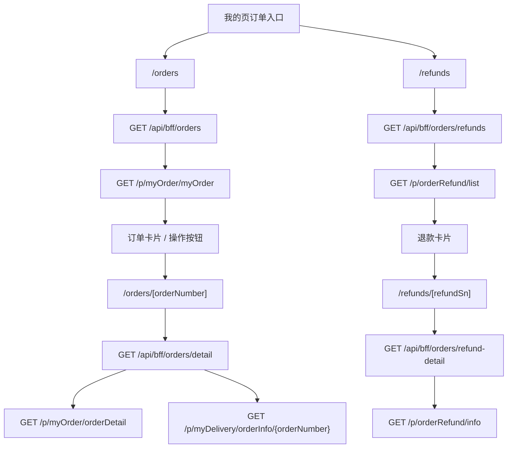

# 对接说明：H5 订单列表、退货退款和订单详情迁移

## 基本信息

- 编号：BRIEF-2026-0627-004
- 关联工作项：`.ai-workspace/tasks/TASK-2026-0627-004-h5-order-list-detail-real-api.md`
- 状态：implemented，待 App token 联调验证
- 目标联调时间：待确认
- 目标上线环境：测试环境

## 需求背景

H5 当前 `/orders` 是个人中心二级页静态 mock。旧 uni-app 已具备成熟订单列表、订单详情和售后退款列表逻辑，本次计划将这些链路迁移到 Next.js H5 项目，并通过 H5 BFF 复用 Java 旧接口。

## 页面范围

| 页面 | 建议 H5 路由 | 说明 | 首期状态 |
| --- | --- | --- | --- |
| 订单列表 | `/orders?status=<status>` | 承接我的页全部订单、待付款、待发货、待收货、已完成 | 已实现，待联调 |
| 退货退款列表 | `/refunds` | 独立售后页面，接口走售后列表 | 已实现，待联调 |
| 普通订单详情 | `/orders/[orderNumber]` | 普通商品 + 快递订单详情 | 已实现，待联调 |
| 退款详情 | `/refunds/[refundSn]` | 退货退款列表详情；旧 `/orders/refunds/[refundSn]` 兼容重定向 | 已实现，待联调 |

## 状态映射

| 我的页入口 | H5 query | 旧 uni-app 路由 | Java 参数 |
| --- | --- | --- | --- |
| 全部订单 | `status=all` | `/package-user/pages/order-list/order-list?sts=0` | `/p/myOrder/myOrder status=0` |
| 待付款 | `status=pending-payment` | `sts=1` | `/p/myOrder/myOrder status=1` |
| 待发货 | `status=pending-shipment` | `sts=2` | `/p/myOrder/myOrder status=2` |
| 待收货 | `status=pending-receipt` | `sts=3` | `/p/myOrder/myOrder status=3` |
| 已完成 | `status=completed` | `sts=5` | `/p/myOrder/myOrder status=5` |
| 退货退款 | `/refunds` | `/package-refund/pages/after-sales/after-sales` | `/p/orderRefund/list` |

注意：`refund` 不是 Java `/p/myOrder/myOrder` 的订单状态，必须走 `/p/orderRefund/list`。

## 数据流

## 接口依赖

| 场景 | Java 接口 | 方法 | 参数来源 |
| --- | --- | --- | --- |
| 普通订单列表 | `/p/myOrder/myOrder` | GET | H5 status 映射 `status`；搜索框 `prodName`；分页 `current/size` |
| 退货退款列表 | `/p/orderRefund/list` | GET | 分页 `current/size`；筛选时间 `startTime/endTime` 首期为空 |
| 普通订单详情 | `/p/myOrder/orderDetail` | GET | URL `orderNumber` |
| 物流摘要 | `/p/myDelivery/orderInfo/{orderNumber}` | GET | URL `orderNumber` |
| 待付款继续支付校验 | `/p/order/getOrderPayInfoByOrderNumber` | GET | 订单号 `orderNumbers` |
| 取消订单 | `/p/myOrder/cancel/{orderNumber}` | PUT | 当前订单号 |
| 确认收货 | `/p/myOrder/receipt/{orderNumber}` | PUT | 当前订单号 |
| 删除订单 | `/p/myOrder/{orderNumber}` | DELETE | 当前订单号 |
| 联系商家留言 | `/p/myOrder/submitMessage` | POST | 订单号、联系方式、留言内容 |
| 退款详情 | `/p/orderRefund/info` | GET | `refundSn` |

所有 Java 请求：

- 由 H5 BFF 服务端发起。
- 使用 `mallToken` 作为 Java `Authorization`。
- 注入 `source: 1`，表示 App 来源。
- 浏览器端只访问 `/api/bff/**`，不直接请求 Java。

## 交互迁移口径

- 列表页搜索：输入商品名后刷新第一页，Java 参数 `prodName=<keyword>`。
- 列表页分页：旧项目 z-paging 参数 `pageNo/pageSize` 映射为 Java `current/size`。
- 普通订单详情：自提 `dvyType=2`、虚拟 `orderMold=1` 在旧项目会跳专属页面，H5 首期展示“该订单类型暂未开放详情”或后置。
- 继续付款：先调用支付信息接口，若 `endTime` 未过期再跳 `/pay-way?orderNumbers=...&orderType=...&dvyType=...`。
- 联系商家：App/小程序旧逻辑偏向拨号，H5 首期保留留言弹窗，提交 `/p/myOrder/submitMessage`。
- 退款申请：旧项目依赖本地缓存 `bbcRefundItem` 传递复杂商品/订单上下文，H5 首期建议只接退款详情；退款申请表单另拆任务。

## H5 侧责任

- [x] 补订单领域类型、mapper 和单元测试。
- [x] 新增订单列表和退款列表 BFF。
- [x] 新增普通订单详情和退款详情 BFF。
- [x] `/orders` 接真实数据，补 `refund` tab。
- [x] 我的页订单入口保持现有 URL，但 `refund` 走售后列表。
- [x] 补普通订单详情页和退款详情页。
- [x] 补取消、确认收货、删除、联系商家、继续付款操作。
- [x] 更新项目文档、页面清单和飞书知识库。

## 后端/测试确认点

- [ ] `/p/myOrder/myOrder` `status=0/1/2/3/5` 在测试环境均有可验证数据。
- [ ] `/p/orderRefund/list` 测试账号有退款/售后数据，或确认空态。
- [ ] `/p/myOrder/orderDetail` 普通快递订单返回字段与旧项目一致。
- [ ] `/p/myDelivery/orderInfo/{orderNumber}` 对无物流订单是否返回空数组。
- [ ] 取消、确认收货、删除订单操作是否需要二次风控或额外参数。
- [ ] 联系商家留言是否继续使用 `/p/myOrder/submitMessage`。

## 验收方式

1. App WebView 写入有效 `mallToken`。
2. 从 `/mine` 分别进入全部、待付款、待发货、待收货、已完成、退货退款。
3. 验证列表接口路径、参数、空态和错误态。
4. 从普通快递订单进入详情，验证详情、物流摘要和费用明细。
5. 对待付款订单点击继续付款，验证跳 `/pay-way`。
6. 对可操作订单验证取消、确认收货、删除和联系商家留言参数。
7. 从退货退款进入退款详情，验证 `refundSn` 参数和展示。

## 确认记录

| 日期 | 角色 | 结论 | 说明 |
| --- | --- | --- | --- |
| 2026-06-27 | H5 | draft | 已完成旧项目流程和接口初步梳理，待确认后进入实现。 |
| 2026-06-27 | H5 | implemented | 已完成 H5 页面、BFF、mapper、操作按钮和单元测试；仍需 App WebView 真实 `mallToken` 验证 Java 接口数据与操作结果。 |
