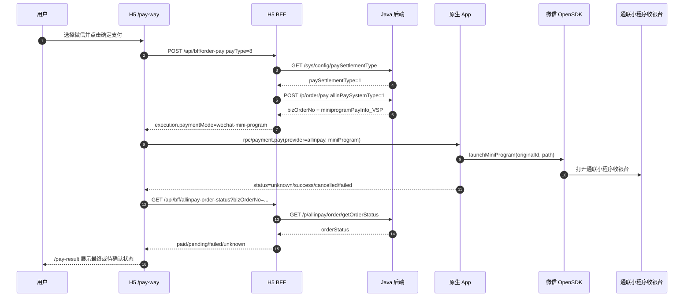

# 对接说明：H5 通联微信支付 Native Bridge

## 基本信息

- 编号：BRIEF-2026-0630-002
- 状态：in_progress
- 关联工作项：`.ai-workspace/tasks/TASK-2026-0629-006-h5-payment-real-flow.md`
- 关联契约：`.ai-workspace/contracts/native-bridge/h5-payment-bridge-contract.md`
- H5 负责人：H5
- 原生 App 负责人：iOS / Android
- 后端负责人：Java 交易后端
- 参考文档：通联《APP 调起收银台小程序》<https://prodoc.allinpay.com/doc/732/>
- 飞书同步：H5 与原生 App 对接说明 <https://v05ctaei9gn.feishu.cn/wiki/OJk1wa43PiR9lTkYs2YcW8llnmf>，2026-06-30 revision 90；H5 BFF/API 对接说明 <https://v05ctaei9gn.feishu.cn/wiki/GPhdwjQ87iQAQskeS6lc9bMOnte>，2026-06-30 revision 13；页面清单 <https://v05ctaei9gn.feishu.cn/wiki/WgaqwTRRUitnRNkCtNPcOcDnnre>，2026-06-30 revision 42。

## 背景

当前测试环境 `paySettlementType=1`，微信支付不走普通微信 App 支付参数，而是由 Java `/p/order/pay` 返回通联小程序收银台参数。H5 已将这些参数归一化为 Native Bridge `payment.pay` 的 `paymentMode=wechat-mini-program` payload，原生 App 需要用微信 OpenSDK 拉起通联小程序收银台。

## 端到端流程



## H5 发给原生的 Bridge

信封：

```json
{
  "module": "rpc",
  "action": "payment.pay",
  "callbackId": "cb_xxx",
  "payload": {
    "provider": "allinpay",
    "settlementProvider": "allinpay",
    "paymentMode": "wechat-mini-program",
    "payType": 8,
    "orderNumbers": "O202606300001",
    "bizOrderNo": "TL202606300001",
    "sdkPayload": {
      "cusid": "990581007426001",
      "appid": "002",
      "trxamt": "12990",
      "reqsn": "O202606300001"
    },
    "miniProgram": {
      "type": "wechat",
      "appId": "wxef277996acc166c3",
      "originalId": "gh_e64a1a89a0ad",
      "path": "pages/orderDetail/orderDetail?cusid=990581007426001&appid=002&trxamt=12990&reqsn=O202606300001",
      "queryString": "cusid=990581007426001&appid=002&trxamt=12990&reqsn=O202606300001",
      "query": {
        "cusid": "990581007426001",
        "appid": "002",
        "trxamt": "12990",
        "reqsn": "O202606300001"
      }
    }
  }
}
```

字段约定：

| 字段 | 说明 |
| --- | --- |
| `provider` | 通联微信固定为 `allinpay`。 |
| `settlementProvider` | 第三方结算方，固定为 `allinpay`。 |
| `paymentMode` | 通联微信固定为 `wechat-mini-program`；原生按该字段和普通微信 SDK 支付分流。 |
| `payType` | Java 枚举，微信为 `8`。 |
| `orderNumbers` | H5 / Java 订单号。 |
| `bizOrderNo` | 通联业务订单号，用于 H5 回查。 |
| `sdkPayload` | Java `/p/order/pay` 返回的小程序支付字段原样保留，用于原生排查和日志对比。 |
| `miniProgram.originalId` | 微信小程序原始 ID，当前为 `gh_e64a1a89a0ad`。 |
| `miniProgram.path` | 已拼好 query 的小程序路径，原生优先直接使用。 |

## 原生实现要求

- `payment.pay` 收到 `paymentMode=wechat-mini-program` 时，不按普通微信支付 SDK 参数解析。
- iOS 使用 `WXLaunchMiniProgramReq`：
  - `userName = payload.miniProgram.originalId`
  - `path = payload.miniProgram.path`
  - `miniProgramType` 按测试包/正式包环境配置
- Android 使用 `WXLaunchMiniProgram.Req`：
  - `userName = payload.miniProgram.originalId`
  - `path = payload.miniProgram.path`
  - `miniprogramType` 按测试包/正式包环境配置
- App 不重新改写 `sdkPayload` 或 `miniProgram.query` 内字段，避免破坏通联签名。
- App 需要校验微信是否安装、OpenSDK 是否注册成功、payload 是否缺字段。
- 打开小程序成功不等于支付成功；如果没有最终支付结果，返回 `status=unknown`，H5 负责回查。

## 原生回传

成功打开但结果未知：

```ts
window.__bridgeHandler.resolve(callbackId, {
  status: "unknown",
  message: "已打开微信收银台"
});
```

用户取消：

```ts
window.__bridgeHandler.resolve(callbackId, {
  status: "cancelled",
  message: "用户取消支付"
});
```

参数错误：

```ts
window.__bridgeHandler.reject(callbackId, "invalid_payload", "缺少 miniProgram.path");
```

不支持该模式：

```ts
window.__bridgeHandler.reject(callbackId, "unsupported", "当前 App 版本不支持通联微信小程序支付");
```

## H5 后续处理

- `status=success/paid`：进入 `/pay-result?sts=1`，仍可刷新订单状态。
- `status=unknown` 且有 `bizOrderNo`：进入 `/pay-result?sts=pending&bizOrderNo=<bizOrderNo>`，调用 `/api/bff/allinpay-order-status`。
- `status=cancelled/failed`：进入结果页展示可重试状态，用户可返回收银台重新支付。
- Bridge reject：停留收银台或进入失败态，不伪造支付成功。

## 联调检查清单

- [ ] H5 console 出现 `[MeuMall][order-pay][h5-request]`，`payType=8`。
- [ ] H5 console 出现 `[MeuMall][order-pay][h5-response]`，`execution.provider=allinpay`、`paymentMode=wechat-mini-program`。
- [ ] 原生收到 `payment.pay`，payload 中 `miniProgram.originalId=gh_e64a1a89a0ad`。
- [ ] 原生使用微信 OpenSDK 打开 `miniProgram.path`，微信能进入通联小程序收银台。
- [ ] 原生回传 `unknown/cancelled/failed/success` 之一，H5 不白屏。
- [ ] H5 进入 `/pay-result` 并调用 `/api/bff/allinpay-order-status` 回查。
- [ ] Java `/p/allinpay/order/getOrderStatus` 返回成功时，H5 展示支付成功。

## 风险

- 微信小程序收银台打开成功不一定能拿到最终支付结果，首期以 H5 回查为准。
- `miniProgramType` 测试/正式环境值需要 App 与通联确认。
- 如果后端更换通联小程序原始 ID 或页面路径，需要同时更新 H5 契约、App 配置和飞书知识库。
