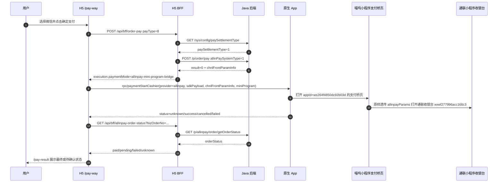

# 对接说明：H5 通联微信支付 Native Bridge

## 基本信息

- 编号：BRIEF-2026-0630-002
- 状态：in_progress
- 关联工作项：`.ai-workspace/tasks/TASK-2026-0629-006-h5-payment-real-flow.md`
- 关联契约：`.ai-workspace/contracts/native-bridge/h5-payment-bridge-contract.md`
- H5 负责人：H5
- 原生 App 负责人：iOS / Android
- 后端负责人：Java 交易后端
- 参考文档：通联《APP 调起收银台小程序》<https://prodoc.allinpay.com/doc/732/>
- 飞书同步：H5 与原生 App 对接说明 <https://v05ctaei9gn.feishu.cn/wiki/OJk1wa43PiR9lTkYs2YcW8llnmf>，2026-07-01 revision 119；H5 BFF/API 对接说明 <https://v05ctaei9gn.feishu.cn/wiki/GPhdwjQ87iQAQskeS6lc9bMOnte>，2026-07-01 revision 16；页面清单 <https://v05ctaei9gn.feishu.cn/wiki/WgaqwTRRUitnRNkCtNPcOcDnnre>，2026-07-01 revision 45。

## 背景

当前测试环境 `paySettlementType=1`，微信支付不走普通微信 App 支付参数，而是由 Java `/p/order/pay` 返回通联小程序收银台参数。H5 会把 Java `/p/order/pay` 完整 `data` 放入 Native Bridge `paymentStartCashier.sdkPayload`；当 `data.result == 0` 且 `data.chnlFrontParamInfo` 可解析时，H5 会把该 JSON 字符串解析为 `paymentStartCashier.chnlFrontParamInfo` 并将对象内所有顶层参数传给原生，同时派生 `paymentMode=allinpay-mini-program-bridge` 和 `miniProgram`。原生 App 只负责打开喵呜小程序支付桥页，桥页再把 `extraData.allinpayParams` 原样传给通联收银台。

## 端到端流程



## H5 发给原生的 Bridge

信封：

```json
{
  "module": "rpc",
  "action": "paymentStartCashier",
  "callbackId": "cb_xxx",
  "payload": {
    "provider": "allinpay",
    "settlementProvider": "allinpay",
    "paymentMode": "allinpay-mini-program-bridge",
    "payType": 8,
    "orderNumbers": "O202606300001",
    "bizOrderNo": "2606300000012651",
    "sdkPayload": {
      "result": "0",
      "reqTraceNum": "2606300000012651",
      "respTraceNum": "20260630173754208901021131",
      "chnlFrontParamInfo": "{\"appletPayParams\":\"{\\\"reqsn\\\":\\\"20260630173754208901021131\\\",\\\"cusid\\\":\\\"660584053996480\\\",\\\"trxamt\\\":\\\"1\\\"}\"}",
      "respCode": "66666",
      "respMsg": "业务已受理"
    },
    "chnlFrontParamInfo": {
      "appletPayParams": "{\"reqsn\":\"20260630173754208901021131\",\"cusid\":\"660584053996480\",\"trxamt\":\"1\"}"
    },
    "miniProgram": {
      "type": "wechat",
      "appId": "wx264f4850dc92b03d",
      "cashierAppId": "wxef277996acc166c3",
      "launchMode": "embedded-mini-program",
      "path": "package-pay/pages/allinpay-bridge/allinpay-bridge",
      "extraData": {
        "allinpayParams": {
          "appletPayParams": "{\"reqsn\":\"20260630173754208901021131\",\"cusid\":\"660584053996480\",\"trxamt\":\"1\"}"
        },
        "orderNumbers": "O202606300001",
        "bizOrderNo": "2606300000012651",
        "reqsn": "20260630173754208901021131",
        "returnToCaller": true
      }
    }
  }
}
```

字段约定：

| 字段 | 说明 |
| --- | --- |
| `provider` | 通联微信固定为 `allinpay`。 |
| `settlementProvider` | 第三方结算方，固定为 `allinpay`。 |
| `paymentMode` | 通联微信固定为 `allinpay-mini-program-bridge`；原生按该字段和普通微信 SDK 支付分流。 |
| `payType` | Java 枚举，微信为 `8`。 |
| `orderNumbers` | H5 / Java 订单号。 |
| `bizOrderNo` | 通联业务订单号；当前 H5 会优先取 `bizOrderNo/orderNo/orderNumber`，没有时回退 `reqTraceNum/respTraceNum`。 |
| `sdkPayload` | Java `/p/order/pay` 返回的完整 `data`，H5 不裁剪、不重命名，用于原生排查和日志对比。 |
| `chnlFrontParamInfo` | H5 对 `sdkPayload.chnlFrontParamInfo` 做 JSON.parse 后的对象，只有 `result == 0` 且解析成功时提供；对象内所有顶层参数都传给原生。 |
| `miniProgram.appId` | 喵呜小程序 appId，当前为 `wx264f4850dc92b03d`。 |
| `miniProgram.path` | 喵呜小程序支付桥页路径，固定为 `package-pay/pages/allinpay-bridge/allinpay-bridge`。 |
| `miniProgram.extraData.allinpayParams` | 通联“小程序收银台支付参数”完整对象，小程序桥页会原样传给通联收银台。 |
| `miniProgram.cashierAppId` | 通联收银台小程序 appId，当前为 `wxef277996acc166c3`，仅用于原生日志和校验参考，App 不直接打开它。 |

## 原生实现要求

- `paymentStartCashier` 收到 `paymentMode=allinpay-mini-program-bridge` 时，不按普通微信支付 SDK 参数解析，也不要直接打开通联收银台小程序。
- iOS / Android 均打开喵呜小程序支付桥页：
  - `appId = payload.miniProgram.appId`
  - `path = payload.miniProgram.path`
  - `extraData = payload.miniProgram.extraData`
- App 不重新改写 `sdkPayload`、`chnlFrontParamInfo` 或 `miniProgram.extraData.allinpayParams` 内字段；需要完整支付返回时读取 `sdkPayload`，需要通联前置参数对象时读取 `chnlFrontParamInfo`，需要打开小程序桥页时读取 `miniProgram`。
- App 需要校验微信是否安装、OpenSDK 是否注册成功、payload 是否缺字段。
- 打开小程序成功不等于支付成功；如果没有最终支付结果，返回 `status=unknown`，H5 负责回查。

## 原生回传

成功打开但结果未知：

```ts
window.__bridgeHandler.resolve(callbackId, {
  status: "unknown",
  message: "已打开喵呜支付桥"
});
```

用户取消：

```ts
window.__bridgeHandler.resolve(callbackId, {
  status: "cancelled",
  message: "用户取消支付"
});
```

参数错误：

```ts
window.__bridgeHandler.reject(callbackId, "invalid_payload", "缺少 miniProgram.path 或 miniProgram.extraData.allinpayParams");
```

不支持该模式：

```ts
window.__bridgeHandler.reject(callbackId, "unsupported", "当前 App 版本不支持通联微信小程序支付");
```

## H5 后续处理

- `status=success/paid`：进入 `/pay-result?sts=1`，仍可刷新订单状态。
- `status=unknown` 且有 `bizOrderNo`：进入 `/pay-result?sts=pending&bizOrderNo=<bizOrderNo>`，调用 `/api/bff/allinpay-order-status`。
- `status=cancelled/failed`：进入结果页展示可重试状态，用户可返回收银台重新支付。
- Bridge reject：停留收银台或进入失败态，不伪造支付成功。

## 联调检查清单

- [ ] H5 console 出现 `[MeuMall][order-pay][h5-request]`，`payType=8`。
- [ ] H5 console 出现 `[MeuMall][order-pay][h5-response]`，`execution.provider=allinpay`、`paymentMode=allinpay-mini-program-bridge`、`chnlFrontParamInfo.appletPayParams` 存在。
- [ ] 原生收到 `paymentStartCashier`，payload 中 `sdkPayload` 为 `/p/order/pay` 完整 `data`，`chnlFrontParamInfo` 为解析后的对象，`miniProgram.appId=wx264f4850dc92b03d`。
- [ ] 原生打开 `miniProgram.path=package-pay/pages/allinpay-bridge/allinpay-bridge`，喵呜小程序桥页能进入通联小程序收银台。
- [ ] 原生回传 `unknown/cancelled/failed/success` 之一，H5 不白屏。
- [ ] H5 进入 `/pay-result` 并调用 `/api/bff/allinpay-order-status` 回查。
- [ ] Java `/p/allinpay/order/getOrderStatus` 返回成功时，H5 展示支付成功。

## 风险

- 微信小程序收银台打开成功不一定能拿到最终支付结果，首期以 H5 回查为准。
- 喵呜小程序支付桥页需要和 uni-app 实现保持一致：完整 `allinpayParams` 只作为对象原样透传，不枚举、不重组、不补签。
- 如果小程序桥 appId、桥页路径或通联收银台 appId 变更，需要同时更新 H5 契约、App 配置和飞书知识库。
