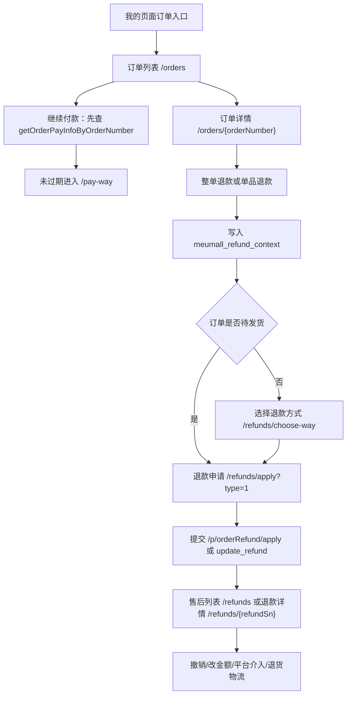

# BRIEF-2026-0708-001 H5 订单与售后完整迁移

## 需求概述

参考旧 uni-app 项目，将订单列表、订单详情、退货退款列表、退款详情、退款申请、平台介入、退货物流等核心流程迁移到当前 `hybird-meumall` Next 项目。页面需要尽量还原旧项目的信息结构和交互逻辑，接口继续沿用 Java 旧接口。

## 本期页面

- `/orders`
- `/orders/[orderNumber]`
- `/orders/logistics/[orderNumber]`
- `/refunds`
- `/refunds/[refundSn]`
- `/refunds/choose-way`
- `/refunds/apply`
- `/refunds/platform-intervention`
- `/refunds/return-logistics`

## 关键流程

## 接口重点

- 订单列表和详情沿用 `/p/myOrder/*`。
- 物流详情沿用 `/p/myDelivery/*`。
- 售后列表、详情、申请、撤销、修改金额、平台介入、退货物流沿用 `/p/orderRefund/*` 和 `/p/orderRefundIntervention/*`。
- Java 请求头 `source` 继续传 `1`。

## 联调风险

- 售后图片上传旧项目依赖 `util.saveAttachFileToPlat`，当前 H5 本期先接收已上传 URL 或图片路径文本，不在本期实现原生文件上传链路。
- 自提、虚拟商品、积分、拼团、秒杀、发票、评价、IM 不作为本期完整业务迁移目标，仅做入口降级。
- 部分售后字段依赖后端返回完整对象，H5 mapper 需保留 `modules.raw` 便于调试。
