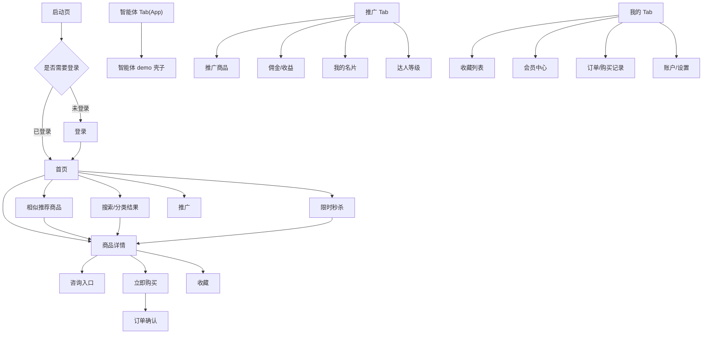

# 喵呜 APP 页面盘点 V0

## 状态

draft，已按 2026-06-12 当前 H5 实际路由和实现状态补充。

## 来源

- Figma：`喵呜APP`
- 文件 key：`bNdmC9k76qgoZtYCdYSemL`
- 初扫日期：2026-06-01
- 最近同步：2026-06-12
- 飞书知识库链接：<https://v05ctaei9gn.feishu.cn/wiki/WgaqwTRRUitnRNkCtNPcOcDnnre>

## 说明

本文是基于 Figma 画布的初步页面盘点，不是最终产品范围。页面名称、端归属、跳转关系和业务含义都需要继续和产品确认。

当前已确认的重要事实：

- 本项目不是传统购物车电商。
- 没有购物车概念。
- 购买链路为“商品详情 -> 立即购买 -> 订单确认”。
- H5 所有页面都需要登录态，每个接口都需要在 header 中传 token。
- 项目是私域平台，App 内只有登录，没有注册。
- 登录后即是达人，不需要申请成为达人。
- 达人和会员是一套体系。
- 智能体由 App 原生负责，当前 H5 不开发智能体具体功能。
- 首页全部由 H5 承载，消息入口也按 H5 处理。
- 我的页面除设置外，其它二级页面暂定都是 H5；设置入口通过 Native Bridge 发送 `router/navigate route=settings`，由 App 打开原生设置页。
- H5 原生页跳转不再使用 `route=native_page + params.name`，而是直接用原生页面名作为 `payload.route`。
- 商品详情当前已接入普通商品 + 快递 + SKU + 立即购买 + 订单确认；秒杀、拼团、自提、同城、正式下单和支付后置。
- 首页首批真实接口已接入 H5 BFF；商品详情和订单确认首批真实链路已接入 H5 BFF；个人中心二级页当前为静态高保真 mock 页面。
- 当前 Figma 先按实验稿推进，后续逐页确认正式页面。

已确认决策详见 `.ai-workspace/product/product-decisions.md`。

## 页面归属标记

- `App`：建议原生实现或由原生壳负责。
- `H5`：建议由 `hybird-meumall` 实现。
- `Hybrid`：原生容器 + H5 内容协作。
- `待定`：需要进一步确认。

## 主 Tab

| 页面 | 主要元素 | 入口 | 跳转目标 | 建议归属 | 登录 | 缓存/交易备注 | 待确认 |
| --- | --- | --- | --- | --- | --- | --- | --- |
| 首页 | logo、搜索、消息、banner、分类入口、限时秒杀、推广带货、推荐商品、底部 Tab | App 启动后主入口 | 搜索、消息、分类、秒杀、推广、商品详情 | Hybrid：Tab 原生，内容 H5 | 是 | 公共内容可缓存；推荐商品价格需实时校验；接口统一带 token | 已接 H5 BFF `/api/bff/home`，首页核心调 Java `/p/app/home/index` |
| 相似推荐商品 | 常规导航、搜索栏、筛选条件、推荐商品列表 | 首页“为您推荐”右侧“更多” | 商品详情、搜索/筛选结果 | H5 | 是 | 商品基础信息可短缓存；价格、优惠、佣金和可购买状态需实时或短 TTL；接口统一带 token | 已实现 `/home/recommend-products`，使用 `/api/bff/home/for-you-products` -> Java `/p/app/home/forYouProds` |
| 首页-无 banner | 搜索、分类、秒杀、推广、推荐商品瀑布流 | 首页配置无 banner 时 | 同首页 | H5 | 是 | 同首页 | 只是首页状态，不单独做页面 |
| 首页-滑动状态 | banner 上滑、搜索栏吸顶或内容滚动状态 | 首页滚动 | 同首页 | H5 | 同首页 | 同首页 | 需要特殊吸顶交互 |
| 智能体 Tab | AI 角色形象、创建按钮、可能的智能体资料 | 底部 Tab | 创建/查看智能体 | App | 是 | 用户私有内容，不共享缓存 | 智能体已有老项目页面和代码；当前只做 demo 壳子 |
| 推广 Tab | 达人信息、收益卡、推广工具、商品列表入口 | 底部 Tab | 推广商品、佣金中心、名片、活动 | H5，Tab 容器原生 | 是 | 收益和佣金需 no-store；佣金按 N+1 计算 | 已完成首批静态/Mock 高保真，真实接口后置 |
| 我的 Tab | 用户信息、钱包/优惠券/足迹入口、收藏、订单、服务工具、设置入口 | 底部 Tab | 钱包、优惠券、足迹、收藏、订单、消息、客服、设置 | Hybrid：Tab 原生，内容 H5 | 是 | 用户私有内容默认 no-store，可弱快照 | `/mine` 已高保真；设置由 App 原生承载，二级页真实接口后置 |

## 当前 H5 实际路由清单

本节以 `hybird-meumall/src/app` 实际存在的 App Router 路由为准，作为飞书知识库和排期表的当前事实源。

### Tab 与通用页面

| 路由 | 页面 | 当前状态 | 数据来源 | 容器策略 | 备注 |
| --- | --- | --- | --- | --- | --- |
| `/` | 首页 | 已接真实 BFF + fallback | Java `/p/app/home/index`，推荐分页接口 | Tab 根 WebView | 推荐商品可下滑加载更多 |
| `/home/recommend-products` | 相似推荐商品 | 已接真实 BFF + fallback | Java `/p/app/home/forYouProds` | 新 H5 WebView | 从首页“更多”进入 |
| `/mine` | 我的 | 已高保真 | 本地 mock | Tab 根 WebView | V1-V5 达人等级图片徽章已接入 |
| `/category` | 分类 | 静态高保真 / mock | 本地 mock | 新 H5 WebView | 真实分类接口待接 |
| `/search` | 搜索 | 静态高保真 / mock | 本地 mock | 当前或新 H5 WebView | 搜索真实接口待接 |
| `/search/ranking` | 搜索热榜 | 静态高保真 / mock | 本地 mock | 新 H5 WebView | 热榜接口待接 |
| `/messages` | 消息中心 | 静态占位 | 本地 mock | 新 H5 WebView | 消息真实接口待接 |
| `/consult` | 咨询入口 | 静态占位 | 本地 mock | 新 H5 WebView | 是否接 IM / 客服待确认 |
| `/seckill` | 限时秒杀 | 静态高保真 / mock | 本地 mock | 新 H5 WebView | 秒杀真实接口后置 |

### 商品、交易与个人中心

| 路由 | 页面 | 当前状态 | 数据来源 | 容器策略 | 备注 |
| --- | --- | --- | --- | --- | --- |
| `/product/[id]` | 商品详情 | 普通商品真实链路已接入 | BFF `/api/bff/product-detail` -> Java `/prod/prodInfo`，辅助聚合评论/店铺接口 | 新 H5 WebView | 支持普通商品、快递、SKU、立即购买、富文本、视频/图片轮播 |
| `/order-confirm` | 订单确认 | 真实商品参数实时校验已接入 | BFF `/api/bff/order-confirm` 重新校验商品/SKU/库存/价格 | 当前 WebView push | 正式下单和支付未接 |
| `/wallet` | 钱包 | 静态高保真 | 本地 mock | 新 H5 WebView | 结算 tab 为页面内 state，不改 URL |
| `/favorites/products` | 我的收藏-商品 | 静态高保真 | 本地 mock | 新 H5 WebView | 支持编辑态，全选/删除为本地交互 |
| `/favorites/shops` | 我的收藏-店铺 | 静态占位 / 低保真 | 本地 mock | 新 H5 WebView | 店铺收藏高保真和接口待补 |
| `/footprints` | 我的足迹 | 静态高保真 | 本地 mock | 新 H5 WebView | 复用收藏横向商品卡 |
| `/coupons` | 我的优惠券 | 静态高保真 | 本地 mock | 新 H5 WebView | 优惠券领取/使用接口待接 |
| `/orders` | 订单列表 | 静态高保真 | 本地 mock | 新 H5 WebView | 支持状态 tab 和空态；订单真实接口待接 |
| 原生 `settings` | 设置页 | App 原生承载 | App | native-page | H5 发送 `router/navigate route=settings` |

### 推广、达人与活动

| 路由 | 页面 | 当前状态 | 数据来源 | 容器策略 | 备注 |
| --- | --- | --- | --- | --- | --- |
| `/promotion` | 推广首页 | 已高保真 / mock | 本地 mock | Tab 根 WebView | V1-V5 达人主题和本地资源已接入 |
| `/promotion/products` | 推广商品 | 静态高保真 / mock | 本地 mock | 新 H5 WebView | “推广”按钮已接 `event/share` |
| `/promotion/commission` | 佣金收益 | 静态页面 / mock | 本地 mock | 新 H5 WebView | 佣金真实字段待确认 |
| `/promotion/card` | 我的名片 | 静态页面 / mock | 本地 mock | 新 H5 WebView | 保存图片/分享需 App 能力 |
| `/promotion/activities` | 活动中心 | 静态高保真 / mock | 本地 mock | 新 H5 WebView | 活动接口待接 |
| `/promotion/activities/[slug]` | 活动详情 | 静态高保真 / mock | 本地 mock | 当前 WebView push | 从活动中心进入 |
| `/promotion/activities/reward-records` | 奖励记录 | 静态高保真 / mock | 本地 mock | 新 H5 WebView | 复用浅绿顶部背景 |
| `/promotion/benefits` | 权益中心 | 静态高保真 / mock | 本地 mock | 新 H5 WebView | 支持 V1-V5 切换动画 |
| `/promotion/level` | 达人等级 | 静态页面 / mock | 本地 mock | 新 H5 WebView | 等级规则接口待确认 |
| `/promotion/rank-center` | 榜单中心 | 静态高保真 / mock | 本地 mock | 新 H5 WebView | 入口页 |
| `/promotion/ranking` | 达人排行榜 | 静态高保真 / mock | 本地 mock | 新 H5 WebView | 默认榜单 |
| `/promotion/ranking/sales` | 达人销量榜 | 静态高保真 / mock | 本地 mock | 新 H5 WebView | Figma 样式已重做 |
| `/promotion/ranking/amount` | 达人销售额榜 | 静态高保真 / mock | 本地 mock | 新 H5 WebView | Figma 样式已重做 |

### BFF 与运行时接口

| 路由 | 用途 | 当前状态 | 后端依赖 | 备注 |
| --- | --- | --- | --- | --- |
| `/api/health` | SSR 健康检查 | 已实现 | 无 | 发布 smoke 使用 |
| `/api/bff/home` | 首页核心数据 | 已实现 | Java `/p/app/home/index` | 依赖 `mallToken` |
| `/api/bff/home/recommend-products` | 首页推荐商品分页 | 已实现 | Java `/p/app/home/recommendProds` | 首页底部加载更多 |
| `/api/bff/home/for-you-products` | 相似推荐商品分页 | 已实现 | Java `/p/app/home/forYouProds` | `/home/recommend-products` 使用 |
| `/api/bff/product-detail` | 商品详情聚合 | 已实现 | Java `/prod/prodInfo`、评论/店铺辅助接口 | 只读聚合，辅助接口失败不拖垮主数据 |
| `/api/bff/order-confirm` | 订单确认实时校验 | 已实现 | 商品详情 BFF / Java 商品详情 | 不执行正式下单 |

## 商品与活动

| 页面 | 主要元素 | 入口 | 跳转目标 | 建议归属 | 登录 | 缓存/交易备注 | 待确认 |
| --- | --- | --- | --- | --- | --- | --- | --- |
| 商品列表/分类结果 | 搜索栏、筛选、分类 tab、商品卡片、推广/购买按钮 | 首页分类、搜索、更多分类 | 商品详情、店铺、筛选 | H5 | 是 | 商品基础信息可缓存；价格和可购买状态需实时 | 分类是普通商品分类还是业务品类 |
| 商品详情 | 商品图、标题、价格、原价、销量、规格/说明、评价/详情、底部咨询输入、立即购买 | 商品卡片 | 咨询、立即购买、店铺、收藏 | H5，支付/登录可调 App | 是 | 价格、库存、购买状态必须实时；详情基础内容可缓存 | “咨询”是否进入 IM；“立即购买”后是否有确认页 |
| 限时秒杀入口卡 | 首页双卡片之一，标题“限时秒杀” | 首页 | 秒杀活动列表 | H5 | 是 | 活动基础可缓存；库存/倒计时需实时 | 秒杀是否需要服务端时间校准 |
| 秒杀活动列表 | 顶部渐变、商品横卡、倒计时、剩余件数、销量、立即秒杀 | 首页秒杀入口 | 商品详情或秒杀购买 | H5 | 是 | 倒计时、库存和秒杀资格必须实时 | 秒杀购买是否绕过普通商品详情 |
| 推广带货入口卡 | 首页双卡片之一，标题“推广带货”、佣金文案 | 首页 | 推广 Tab 或推广商品 | H5 | 是 | 佣金配置需实时或短缓存 | 点击进入推广首页还是推广商品列表 |
| 商品收藏 | 商品卡片、价格、删除按钮、商品/店铺收藏 tab | 我的或商品详情收藏入口 | 商品详情、删除收藏、切换店铺收藏 | H5 | 是 | 私有收藏 no-store，可弱快照 | 删除是否需要二次确认 |
| 店铺收藏 | 店铺图片、店铺名称、删除按钮、商品/店铺收藏 tab | 我的或店铺入口 | 店铺主页、删除收藏、切换商品收藏 | H5 | 是 | 私有收藏 no-store，可弱快照 | 是否存在店铺主页 |

## 推广、达人与佣金

| 页面 | 主要元素 | 入口 | 跳转目标 | 建议归属 | 登录 | 缓存/交易备注 | 待确认 |
| --- | --- | --- | --- | --- | --- | --- | --- |
| 推广首页 | 达人头像、昵称、收益数据、工具入口、活动 banner、商品推荐 | 推广 Tab | 推广商品、佣金中心、名片、任务/活动 | H5 | 是 | 收益数据 no-store；工具入口配置可缓存 | 具体收益字段和结算规则 |
| 推广商品列表 | 搜索、筛选、商品列表、佣金、去推广按钮 | 推广首页 | 商品详情、生成推广素材、分享 | H5 | 是 | 商品可短缓存；佣金需实时或短 TTL | 去推广是生成链接、海报、还是分享名片 |
| 我的优惠券/券列表 | 券卡片、金额、有效期、状态按钮 | 推广或我的 | 券详情、使用/分享 | H5 | 是 | 私有优惠券 no-store | 这是优惠券、佣金券还是推广券 |
| 我的名片 | 小喵名片、二维码、保存到手机、分享名片 | 推广或我的 | 系统分享、保存相册 | Hybrid：内容 H5，保存/分享 App | 是 | 二维码可短期缓存；个人信息私有 | 名片用于推广还是个人主页 |
| 达人等级首页 | 等级徽章 V1-V5、奖励活动、排行榜、权益入口 | 推广或我的 | 等级详情、权益中心、排行榜 | H5 | 是 | 等级和权益需登录实时或短 TTL | 达人等级是否影响佣金比例 |
| 达人等级详情 | V1-V5 不同主题、等级权益、升级条件、佣金比例 | 达人等级首页 | 权益中心、任务、规则说明 | H5 | 是 | 用户等级 no-store；规则可缓存 | 等级升级条件和计算方式 |
| 权益中心 | 当前等级、未解锁权益、权益列表、开关或进度 | 达人等级详情 | 权益详情、升级任务 | H5 | 是 | 用户进度 no-store；权益规则可缓存 | 是否有付费会员和达人等级两套体系 |
| 排行榜 | 用户列表、头像、排名、收益或成交数据 | 达人等级或推广 | 用户主页、规则说明 | H5 | 是/待定 | 榜单可短缓存；个人敏感字段需脱敏 | 榜单维度和刷新频率 |
| 佣金/收益明细 | 收益列表、交易记录、状态筛选、金额 | 推广首页或我的 | 订单/收益详情 | H5 | 是 | 强私有 no-store | 提现、结算、退款扣回规则 |

## 智能体

| 页面 | 主要元素 | 入口 | 跳转目标 | 建议归属 | 登录 | 缓存/交易备注 | 待确认 |
| --- | --- | --- | --- | --- | --- | --- | --- |
| 智能体首页/空状态 | 小喵形象、创建按钮、底部 Tab | 智能体 Tab | 创建智能体、智能体详情 | App | 是 | 用户私有，默认 no-store | 已有老项目实现；当前只需要 demo 壳子 |
| 智能体资料页 | 角色形象、昵称、按钮、功能入口 | 智能体 Tab | 商品推荐、对话、设置 | App | 是 | 用户私有，默认 no-store | 当前 H5 不实现 |
| 智能体创建/编辑 | 头像、昵称、配置项 | 智能体入口 | 保存、预览 | App | 是 | 表单草稿可本地缓存，敏感配置不缓存 | 当前 H5 不实现 |

## 登录、会员与账户

| 页面 | 主要元素 | 入口 | 跳转目标 | 建议归属 | 登录 | 缓存/交易备注 | 待确认 |
| --- | --- | --- | --- | --- | --- | --- | --- |
| 启动页 | 品牌、吉祥物、slogan | App 启动 | 登录或首页 | App | 否 | 不涉及 | 是否需要广告或版本检查 |
| 登录 | 手机号/验证码或授权登录 | 未登录访问受限功能 | 首页、上一页 | App 优先 | 否 | 凭证只能进安全存储 | 私域平台只有登录，没有注册 |
| 会员/达人中心 | 会员等级、达人等级、权益、卡片、开通/升级入口 | 我的或达人体系 | 支付、权益详情 | H5，支付相关调 App | 是 | 支付和权益状态 no-store | 达人与会员是一套体系，UI 名称可能不同 |
| 账户/设置 | 个人资料、账号安全、退出登录 | 我的 | 编辑资料、登录页 | App 或 H5 待定 | 是 | 退出登录必须清理私有缓存 | 是否已有原生账号体系 |

## 购买与订单

| 页面 | 主要元素 | 入口 | 跳转目标 | 建议归属 | 登录 | 缓存/交易备注 | 待确认 |
| --- | --- | --- | --- | --- | --- | --- | --- |
| 立即购买入口 | 商品详情底部按钮 | 商品详情 | 订单确认 | Hybrid | 是 | 必须实时确认价格、库存、资格 | 订单确认页后续补充 |
| 咨询入口 | 商品详情底部输入栏/问题快捷项 | 商品详情 | 咨询入口占位 | H5 | 是 | 暂不实现具体咨询内容 | 只提供入口，不做 IM 内容 |
| 订单/购买记录 | 订单列表、状态、金额、商品 | 我的或购买成功 | 订单详情、售后 | H5 | 是 | 私有 no-store，可弱摘要 | 是否有订单概念；状态枚举是什么 |
| 支付流程 | 支付确认、支付方式、结果 | 立即购买 | 支付结果、订单详情 | App 优先 | 是 | 交易类 no-store，不离线承诺 | 支付渠道和原生能力 |

## 初步跳转关系

## 端归属初步建议

### App 优先

- 启动页。
- 登录和凭证安全存储。
- 底部 Tab 容器。
- WebView 生命周期和多 WebView 复用。
- 支付流程。
- 系统分享、保存相册、相机/相册权限。
- 智能体 Tab 和智能体具体页面。

### H5 优先

- 首页内容。
- 商品列表、分类结果、商品详情。
- 限时秒杀。
- 商品收藏和店铺收藏。
- 推广首页、推广商品、佣金明细。
- 达人等级、权益中心、排行榜。
- 会员权益展示页，若不涉及支付。
- 我的页面除设置外的二级页面。
- 消息入口。

### 待定

- 会员中心开通页。
- 订单和售后。
- 订单确认页。

## 仍待确认问题

1. 商品分类是普通商品类目，还是喵呜专属业务品类？
2. 商品是否一定归属店铺？是否存在店铺主页？
3. 商品详情中的收藏、分享、评价、详情、规格规则是什么？
4. 秒杀是否需要服务端时间校准？秒杀购买是否绕过普通商品详情？
5. 推广商品的“去推广”是生成链接、海报、名片，还是直接分享？
6. 达人/会员等级 V1-V5 的升级条件、权益和页面样式。
7. 佣金 N+1、提现、冻结、退款扣回等完整规则。
8. 订单确认页、支付流程、订单/购买记录和售后是否全部需要 H5。
9. 后台管理端首批要管理哪些内容：banner、分类、活动、推荐商品、秒杀、推广商品等。
