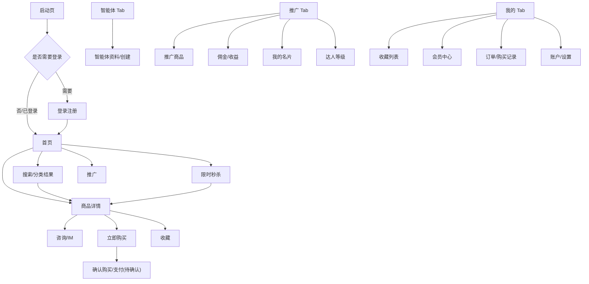

# 喵呜 APP 页面盘点 V0

## 状态

draft

## 来源

- Figma：`喵呜APP`
- 文件 key：`bNdmC9k76qgoZtYCdYSemL`
- 初扫日期：2026-06-01

## 说明

本文是基于 Figma 画布的初步页面盘点，不是最终产品范围。页面名称、端归属、跳转关系和业务含义都需要继续和产品确认。

当前已确认的重要事实：

- 本项目不是传统购物车电商。
- 当前设计没有明确购物车主路径。
- 交易更像“商品详情 -> 咨询或立即购买”的直接购买路径。
- 推广、达人等级、佣金和智能体是核心业务，不是附属功能。

## 页面归属标记

- `App`：建议原生实现或由原生壳负责。
- `H5`：建议由 `hybird-meumall` 实现。
- `Hybrid`：原生容器 + H5 内容协作。
- `待定`：需要进一步确认。

## 主 Tab

| 页面 | 主要元素 | 入口 | 跳转目标 | 建议归属 | 登录 | 缓存/交易备注 | 待确认 |
| --- | --- | --- | --- | --- | --- | --- | --- |
| 首页 | logo、搜索、消息、banner、分类入口、限时秒杀、推广带货、推荐商品、底部 Tab | App 启动后主入口 | 搜索、消息、分类、秒杀、推广、商品详情 | Hybrid：Tab 原生，内容 H5 | 否，部分模块可能需要 | 公共内容可缓存；推荐商品价格需实时校验 | 首页是否全部 H5；消息入口是否原生 |
| 首页-无 banner | 搜索、分类、秒杀、推广、推荐商品瀑布流 | 首页配置无 banner 时 | 同首页 | H5 | 否 | 同首页 | 是否是首页状态还是独立页面 |
| 首页-滑动状态 | banner 上滑、搜索栏吸顶或内容滚动状态 | 首页滚动 | 同首页 | H5 | 否 | 同首页 | 是否需要特殊吸顶交互 |
| 智能体 Tab | AI 角色形象、创建按钮、可能的智能体资料 | 底部 Tab | 创建/查看智能体 | 待定，偏 App 或 Hybrid | 是 | 用户私有内容，不共享缓存 | 智能体是原生能力、H5 页面，还是外部服务 |
| 推广 Tab | 达人信息、收益卡、推广工具、商品列表入口 | 底部 Tab | 推广商品、佣金中心、名片、活动 | H5，Tab 容器原生 | 是 | 收益和佣金需实时或 no-store | 推广是否面向达人用户，是否所有用户可见 |
| 我的 Tab | 用户信息、功能入口、收藏、订单/记录、会员或设置入口 | 底部 Tab | 收藏、会员、收益、设置等 | Hybrid：Tab 原生，内容 H5 或 App 混合 | 是 | 用户私有内容默认 no-store，可弱快照 | 哪些“我的”功能必须原生 |

## 商品与活动

| 页面 | 主要元素 | 入口 | 跳转目标 | 建议归属 | 登录 | 缓存/交易备注 | 待确认 |
| --- | --- | --- | --- | --- | --- | --- | --- |
| 商品列表/分类结果 | 搜索栏、筛选、分类 tab、商品卡片、推广/购买按钮 | 首页分类、搜索、更多分类 | 商品详情、店铺、筛选 | H5 | 否，操作可能需要 | 商品基础信息可缓存；价格和可购买状态需实时 | 分类是普通商品分类还是业务品类 |
| 商品详情 | 商品图、标题、价格、原价、销量、规格/说明、评价/详情、底部咨询输入、立即购买 | 商品卡片 | 咨询、立即购买、店铺、收藏 | H5，支付/登录可调 App | 否，购买/收藏/咨询可能需要 | 价格、库存、购买状态必须实时；详情基础内容可缓存 | “咨询”是否进入 IM；“立即购买”后是否有确认页 |
| 限时秒杀入口卡 | 首页双卡片之一，标题“限时秒杀” | 首页 | 秒杀活动列表 | H5 | 否 | 活动基础可缓存；库存/倒计时需实时 | 秒杀是否需要服务端时间校准 |
| 秒杀活动列表 | 顶部渐变、商品横卡、倒计时、剩余件数、销量、立即秒杀 | 首页秒杀入口 | 商品详情或秒杀购买 | H5 | 否，秒杀操作需要 | 倒计时、库存和秒杀资格必须实时 | 秒杀购买是否绕过普通商品详情 |
| 推广带货入口卡 | 首页双卡片之一，标题“推广带货”、佣金文案 | 首页 | 推广 Tab 或推广商品 | H5 | 是 | 佣金配置需实时或短缓存 | 点击进入推广首页还是推广商品列表 |
| 商品收藏 | 商品卡片、价格、删除按钮、商品/店铺收藏 tab | 我的或商品详情收藏入口 | 商品详情、删除收藏、切换店铺收藏 | H5 | 是 | 私有收藏 no-store，可弱快照 | 删除是否需要二次确认 |
| 店铺收藏 | 店铺图片、店铺名称、删除按钮、商品/店铺收藏 tab | 我的或店铺入口 | 店铺主页、删除收藏、切换商品收藏 | H5 | 是 | 私有收藏 no-store，可弱快照 | 是否存在店铺主页 |

## 推广、达人与佣金

| 页面 | 主要元素 | 入口 | 跳转目标 | 建议归属 | 登录 | 缓存/交易备注 | 待确认 |
| --- | --- | --- | --- | --- | --- | --- | --- |
| 推广首页 | 达人头像、昵称、收益数据、工具入口、活动 banner、商品推荐 | 推广 Tab | 推广商品、佣金中心、名片、任务/活动 | H5 | 是 | 收益数据 no-store；工具入口配置可缓存 | 具体收益字段和结算规则 |
| 推广商品列表 | 搜索、筛选、商品列表、佣金、去推广按钮 | 推广首页 | 商品详情、生成推广素材、分享 | H5 | 是 | 商品可短缓存；佣金需实时或短 TTL | 去推广是生成链接、海报、还是分享名片 |
| 我的优惠券/券列表 | 券卡片、金额、有效期、状态按钮 | 推广或我的 | 券详情、使用/分享 | H5 | 是 | 私有优惠券 no-store | 这是优惠券、佣金券还是推广券 |
| 我的名片 | 小喵名片、二维码、保存到手机、分享名片 | 推广或我的 | 系统分享、保存相册 | Hybrid：内容 H5，保存/分享 App | 是 | 二维码可短期缓存；个人信息私有 | 名片用于推广还是个人主页 |
| 达人等级首页 | 等级徽章 V1-V5、奖励活动、排行榜、权益入口 | 推广或我的 | 等级详情、权益中心、排行榜 | H5 | 是 | 等级和权益需登录实时或短 TTL | 达人等级是否影响佣金比例 |
| 达人等级详情 | V1-V5 不同主题、等级权益、升级条件、佣金比例 | 达人等级首页 | 权益中心、任务、规则说明 | H5 | 是 | 用户等级 no-store；规则可缓存 | 等级升级条件和计算方式 |
| 权益中心 | 当前等级、未解锁权益、权益列表、开关或进度 | 达人等级详情 | 权益详情、升级任务 | H5 | 是 | 用户进度 no-store；权益规则可缓存 | 是否有付费会员和达人等级两套体系 |
| 排行榜 | 用户列表、头像、排名、收益或成交数据 | 达人等级或推广 | 用户主页、规则说明 | H5 | 是/待定 | 榜单可短缓存；个人敏感字段需脱敏 | 榜单维度和刷新频率 |
| 佣金/收益明细 | 收益列表、交易记录、状态筛选、金额 | 推广首页或我的 | 订单/收益详情 | H5 | 是 | 强私有 no-store | 提现、结算、退款扣回规则 |

## 智能体

| 页面 | 主要元素 | 入口 | 跳转目标 | 建议归属 | 登录 | 缓存/交易备注 | 待确认 |
| --- | --- | --- | --- | --- | --- | --- | --- |
| 智能体首页/空状态 | 小喵形象、创建按钮、底部 Tab | 智能体 Tab | 创建智能体、智能体详情 | 待定 | 是 | 用户私有，默认 no-store | 智能体具体能力是什么 |
| 智能体资料页 | 角色形象、昵称、按钮、功能入口 | 智能体 Tab | 商品推荐、对话、设置 | 待定 | 是 | 用户私有，默认 no-store | 是 AI 助手、数字人，还是导购身份 |
| 智能体创建/编辑 | 头像、昵称、配置项 | 智能体入口 | 保存、预览 | 待定，可能 App 原生更适合 | 是 | 表单草稿可本地缓存，敏感配置不缓存 | 是否需要调用相机/相册/模型服务 |

## 登录、会员与账户

| 页面 | 主要元素 | 入口 | 跳转目标 | 建议归属 | 登录 | 缓存/交易备注 | 待确认 |
| --- | --- | --- | --- | --- | --- | --- | --- |
| 启动页 | 品牌、吉祥物、slogan | App 启动 | 登录或首页 | App | 否 | 不涉及 | 是否需要广告或版本检查 |
| 登录注册 | 手机号/验证码或授权登录 | 未登录访问受限功能 | 首页、上一页 | App 优先 | 否 | 凭证只能进安全存储 | 登录方式和合规要求 |
| 会员中心 | 会员等级、权益、卡片、开通/续费入口 | 我的或达人体系 | 支付、权益详情 | 待定 | 是 | 支付和权益状态 no-store | 会员体系和达人等级是否独立 |
| 账户/设置 | 个人资料、账号安全、退出登录 | 我的 | 编辑资料、登录页 | App 或 H5 待定 | 是 | 退出登录必须清理私有缓存 | 是否已有原生账号体系 |

## 购买与订单

| 页面 | 主要元素 | 入口 | 跳转目标 | 建议归属 | 登录 | 缓存/交易备注 | 待确认 |
| --- | --- | --- | --- | --- | --- | --- | --- |
| 立即购买入口 | 商品详情底部按钮 | 商品详情 | 确认购买、支付或咨询 | Hybrid | 是 | 必须实时确认价格、库存、资格 | 是否存在确认购买页 |
| 咨询入口 | 商品详情底部输入栏/问题快捷项 | 商品详情 | IM 或商品咨询 | App 或 Hybrid | 是 | 消息不可共享缓存 | 是否使用原生 IM |
| 订单/购买记录 | 订单列表、状态、金额、商品 | 我的或购买成功 | 订单详情、售后 | H5 | 是 | 私有 no-store，可弱摘要 | 是否有订单概念；状态枚举是什么 |
| 支付流程 | 支付确认、支付方式、结果 | 立即购买 | 支付结果、订单详情 | App 优先 | 是 | 交易类 no-store，不离线承诺 | 支付渠道和原生能力 |

## 初步跳转关系

## 端归属初步建议

### App 优先

- 启动页。
- 登录注册和凭证安全存储。
- 底部 Tab 容器。
- WebView 生命周期和多 WebView 复用。
- 支付流程。
- 系统分享、保存相册、相机/相册权限。

### H5 优先

- 首页内容。
- 商品列表、分类结果、商品详情。
- 限时秒杀。
- 商品收藏和店铺收藏。
- 推广首页、推广商品、佣金明细。
- 达人等级、权益中心、排行榜。
- 会员权益展示页，若不涉及支付。

### 待定

- 智能体创建和资料页。
- 咨询/IM。
- 会员中心开通页。
- 订单和售后。

## 关键待确认问题

1. 主 Tab 最终是否确定为：首页、智能体、推广、我的？
2. 是否完全没有购物车？是否有“收藏后购买”或“批量购买”需求？
3. 商品类型是什么：实物商品、账号/道具、服务、推广商品，还是混合？
4. 商品详情里的“立即购买”后进入什么页面？
5. 商品详情里的咨询是否进入 IM？IM 是原生还是 H5？
6. 推广和达人是否所有用户可用，还是需要申请成为达人？
7. 佣金是否实时计算？是否存在提现？
8. 达人等级和会员等级是否是两套体系？
9. 智能体的核心功能是什么？是 AI 导购、个人分身、客服，还是创作者工具？
10. 哪些页面必须原生实现，哪些可以 H5？
11. Figma 中哪些画板是旧稿、实验稿或切图素材，不属于正式范围？
12. 后台管理端是否也需要按这些业务域扩展？
